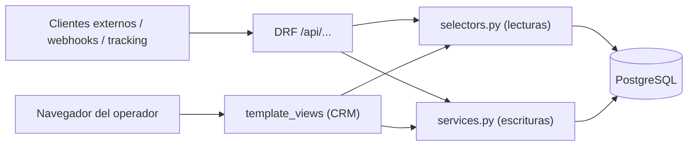

# Acceso a Datos: API REST e Interfaz del CRM

> Tras la [consolidación del frontend](consolidation/FRONTEND_CONSOLIDATION.md), ya **no existe** la capa cliente Next.js (`src/lib/server-actions.ts`, axios, React Query). Este documento describe cómo acceden a los datos las dos superficies actuales: la **API REST** (clientes externos) y el **CRM HTML** (operador), ambas sobre la misma capa `selectors`/`services`.

## Dos consumidores, una lógica



Regla clave: **el CRM no hace loopback** hacia la API. Las vistas de plantilla llaman directamente a `selectors`/`services`, las mismas funciones que usan los ViewSets de DRF. Ver la fuente canónica en [BACKEND.md](BACKEND.md#-capa-de-servicios-y-selectores).

## API REST (para integraciones)

La API REST se preserva como superficie de integración de primera clase. Casos de uso:

- Ingestión de webhooks externos (p. ej. Meta/Shopify).
- Scripts de tracking de cliente.
- Cualquier cliente programático futuro.

### Autenticación

- **JWT** para la API (`/api/...`).
- La sesión Django (`@login_required`) protege el CRM HTML; no aplica a la API.

### Patrones de request/response

Los patrones de paginación, filtrado, ordenación y forma de respuesta de DRF se documentan en [BACKEND_API_PATTERNS.md](BACKEND_API_PATTERNS.md). El catálogo de endpoints está en [API.md](API.md).

Resumen rápido:

| Tipo de endpoint | Respuesta DRF | Acceso |
|------------------|---------------|--------|
| Lista (paginada) | `{count, next, previous, results: [...]}` | `response.results` |
| Detalle | `{id, ...}` | objeto directo |
| Create/Update | objeto creado/actualizado | objeto directo |
| Delete | `204 No Content` | sin cuerpo |

### Delegación en services/selectors

Los ViewSets no contienen lógica de escritura ni de M2M; delegan:

```python
class ProductViewSet(viewsets.ModelViewSet):
    def get_queryset(self):
        return products_list_queryset()              # selectors.py

    def perform_create(self, serializer):
        create_product(**write_payload(self.request, serializer))   # services.py

    def perform_update(self, serializer):
        update_product(serializer.instance, **write_payload(self.request, serializer))

    def perform_destroy(self, instance):
        delete_product(instance)                     # services.py
```

Las validaciones compartidas (p. ej. `validate_interaction_entities`, `validate_person_document`) se invocan tanto desde el `validate` del serializer como desde el servicio, evitando duplicación.

## CRM HTML (para el operador)

El CRM obtiene datos vía `selectors` y escribe vía `services`, usando formularios Django. No usa `fetch`/axios ni estado de cliente.

```python
# template_views.py (lectura)
def product_list(request):
    context = get_products_list_context(request.GET)   # selectors.py
    return render(request, "products/list.html", context)

# template_views.py (escritura)
def product_create(request):
    form = ProductForm(request.POST or None)
    if request.method == "POST" and form.is_valid():
        product = create_product(**form.cleaned_data)  # services.py
        messages.success(request, "Producto creado.")
        return redirect("products_html:detail", pk=product.pk)
    return render(request, "products/create.html", {"form": form})
```

Para los componentes de plantilla (layout, sidebar, header, formularios, estilos) ver [FRONTEND_COMPONENTS.md](FRONTEND_COMPONENTS.md).

## Notas de seguridad

- **CSRF**: los formularios HTML usan ``; las mutaciones (incluido logout) van por `POST`.
- **CORS**: configurado solo para clientes externos de la API; el CRM es same-origin, por lo que no requiere CORS.
- **Sin secretos en cliente**: al no haber SPA, no se almacenan tokens en el navegador para el CRM (usa cookies de sesión).

---

> Documentos relacionados: [API.md](API.md) (catálogo de endpoints), [BACKEND_API_PATTERNS.md](BACKEND_API_PATTERNS.md) (patrones DRF), [BACKEND.md](BACKEND.md) (capa selectors/services), [FRONTEND_CONSOLIDATION.md](consolidation/FRONTEND_CONSOLIDATION.md) (historial de migración).
