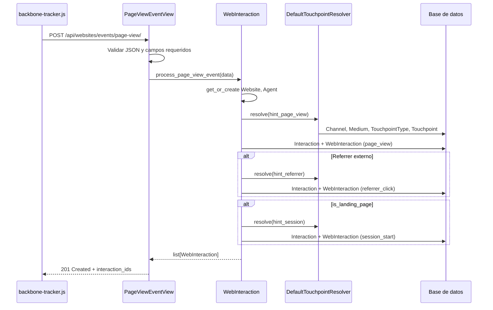

# App Websites - BackboneOS

Documentación consolidada de la app `websites`: captura, clasificación y procesamiento de interacciones web con arquitectura v2.0.

---

<a id="vision-general"></a>
## Visión general

La app `websites` extiende el núcleo de interacciones de BackboneOS para capturar y organizar actividad de sitios web. Proporciona:

- Seguimiento de interacciones web anónimas y autenticadas
- Resolución de touchpoints agnóstica al sujeto con patrón de pre-creación
- Análisis avanzado de tráfico (UTM, referrer, user agent con ua-parser)
- Enfoque multi-interacción para atribución completa
- Integración con la estructura organizacional y el CRM

La app convierte actividad web anónima en interacciones trazables dentro del ecosistema CRM de BackboneOS.

### Modelos principales

| Modelo | Propósito |
|--------|-----------|
| `Website` | Sitio gestionado por la organización (`name`, `base_url`, `channel`, `division`, `active`). Crea/actualiza automáticamente un `Channel` con `source_type='owned'` al guardar. |
| `WebInteraction` | Extiende `AbstractConnectorInteraction` con campos de navegador, UTM, payload y resolución v2.0. Incluye 8 procesadores estáticos de eventos. |
| `WebAgent` | Información de navegador/dispositivo parseada con `ua-parser-js` (browser, OS, device, bot). |
| `WebSession` | Sesión web continua con lógica de 30 minutos, métricas de páginas y detección de rebote. |

### Estructura de archivos

```
websites/
├── models.py              # Website, WebInteraction, WebAgent, WebSession
├── admin.py
├── views.py               # Endpoints de eventos (uno por tipo)
├── urls.py
├── tests/
├── static/websites/js/
│   ├── backbone-tracker.js
│   └── backbone-config.js
├── management/commands/
│   └── ensure_website_channels.py
└── README.md              # Punto de entrada (enlace a esta documentación)
```

---

<a id="arquitectura-v2"></a>
## Arquitectura v2.0

Migración completada (enero 2025). La app eliminó 453 líneas de código v1.0 (reducción del 23 %) y adoptó el patrón subject-agnostic del conector web.

### Cambios principales

| Aspecto | v1.0 (eliminado) | v2.0 (actual) |
|---------|------------------|---------------|
| Resolución de touchpoint | Post-creación con hooks | Pre-creación antes de `Interaction` |
| API del resolver | Pasaje de objetos | Parámetros explícitos (`connector_type`, `source_identifier`) |
| Hint building | `infer_touchpoint_hint()` | `build_touchpoint_hint_from_event_data()` estático |
| Operaciones DB | 3+ saves por interacción | 2 saves por interacción |
| Código total | 1.970 líneas | 1.517 líneas |

### Patrón canónico de procesamiento

```python
# Paso 1: Construir hint desde datos crudos
hint = WebInteraction.build_touchpoint_hint_from_event_data(event_data, website)

# Paso 2: Resolver touchpoint ANTES de crear la interacción
resolver = DefaultTouchpointResolver(DatabaseMappingProvider())
touchpoint = resolver.resolve(
    hint,
    connector_type='web',
    source_identifier=cls._extract_domain(website.base_url)
)

# Paso 3: Crear Interaction + WebInteraction atómicamente
web_interaction = cls._create_web_interaction_with_interaction(
    event_data=event_data,
    agent=agent,
    action=action,
    touchpoint=touchpoint,  # Ya resuelto
    interaction_payload={...},
    website=website
)
```

### Procesadores de eventos (8 total)

| Tipo de evento | Método | Action code | TouchpointType |
|----------------|--------|-------------|----------------|
| Page View | `process_page_view_event()` | `page_view` | `web_page` |
| Page Read | `process_page_read_event()` | `page_read` | `web_page` |
| Click | `process_click_event()` | `click` | `web_button` |
| Form Submit | `process_form_submit_event()` | `form_submit` | `web_form` |
| Download | `process_download_event()` | `download` | `web_download` |
| Video Play | `process_video_play_event()` | `video_play` | `web_video` |
| Search | `process_search_event()` | `search` | `web_search` |
| Newsletter Signup | `process_newsletter_signup_event()` | `newsletter_signup` | `web_signup` |

### Diferenciación de eventos

- **`page_view`**: cada carga de página; puede generar hasta 3 interacciones (ver [Enfoque multi-interacción](#enfoque-multi-interaccion)).
- **`page_read`**: engagement significativo (tiempo, scroll o interacción); una sola interacción; requiere page view previo en la misma sesión.
- **`session_start`**: inferido en el servidor cuando `is_landing_page=True`, no enviado directamente por el script.

Categorías de `Action Type`: digital (`click`, `page_view`, `form_submit`, `page_read`), telefónica (`incoming_call`), presencial (`event_attended`), sistema (`action_type: null` para eventos inferidos).

---

<a id="clasificacion-tridimensional"></a>
## Clasificación tridimensional

Cada touchpoint se clasifica en tres dimensiones independientes del campo `interactions.Interaction.action`:

### Channel (DÓNDE)

Identifica el contexto o ubicación de la interacción.

- Ejemplos: `esan.edu.pe` (owned), `google` (externo), `facebook` (externo)
- Lógica interna: dominio del sitio web (`website.channel.code`)
- Lógica de atribución: UTM source o dominio del referrer

### Medium (CÓMO)

Identifica el método de comunicación o tráfico.

- Ejemplos: `organic_search`, `cpc`, `social_media`, `email`, `referral`, `direct`, `web_interaction`
- Lógica interna: siempre `web_interaction`
- Lógica de atribución: UTM medium o análisis de referrer (`_analyze_referrer_medium()`)

### TouchpointType (QUÉ)

Identifica el tipo funcional del touchpoint web.

- Ejemplos: `web_page`, `web_form`, `web_button`, `web_video`, `web_search_referral`
- Mapeo por tipo de evento en `build_touchpoint_hint_from_event_data()`

### Modos de construcción de hints

**Modo interno** (`hint_type='internal'`) — actividad en el sitio:

```python
TouchpointHint(
    code="web_page",
    url=full_url,
    channel_code=website_channel,
    medium_code="web_interaction",
    touchpoint_type_code="web_page",
    label=page_title,
)
```

**Modo atribución** (`hint_type='referrer'` o `'session'`) — origen del visitante:

```python
TouchpointHint(
    code=composite_code,  # ej. "google.organic_search.web_search_referral"
    url=referrer_url,
    parent_code=parent_code,
    channel_code=utm_source or referrer_domain,
    medium_code=utm_medium or analyzed_medium,
    touchpoint_type_code="web_search_referral",
)
```

### Ejemplo de clasificación

```python
# Evento: envío de formulario de contacto en example.com desde Google Ads
Channel: "example.com"       # DÓNDE: ocurrió en el sitio
Medium: "cpc"                # CÓMO: tráfico de pago (utm_medium=cpc)
TouchpointType: "web_form"   # QUÉ: envío de formulario web
```

### Jerarquía parent-child

Los touchpoints de atribución soportan relaciones padre-hijo para rollup analítico:

- **Padre**: `google.cpc` — rollup de campaña
- **Hijo**: `google.cpc.web_search_referral.summer_mba_2025` — creative específico

---

<a id="enfoque-multi-interaccion"></a>
## Enfoque multi-interacción

Un único evento `page_view` puede crear **hasta 3 instancias de `WebInteraction`** (y 3 registros `Interaction`).

### 1. Page View (siempre)

| Campo | Valor |
|-------|-------|
| Action | `page_view` |
| TouchpointType | `web_page` |
| Channel | Dominio del sitio |
| Medium | `web_interaction` (interno) |
| Criticidad | **CRÍTICO** — fallo aborta toda la petición |

### 2. Referrer Click (condicional)

| Campo | Valor |
|-------|-------|
| Action | `referrer_click` |
| TouchpointType | `web_search_referral` (u otro según medium) |
| Condición | Referrer externo distinto de `website_base` |
| Criticidad | **OPCIONAL** — fallo se registra y continúa |

### 3. Session Start (condicional)

| Campo | Valor |
|-------|-------|
| Action | `session_start` |
| TouchpointType | según atribución (misma lógica que referrer) |
| Condición | `payload.is_landing_page=True` |
| Criticidad | **OPCIONAL** — fallo se registra y continúa |

### Escenarios

| Escenario | Interacciones creadas |
|-----------|----------------------|
| Visitante nuevo desde Google, landing page | 3 (page_view + referrer_click + session_start) |
| Navegación interna, no landing | 1 (solo page_view) |
| Visita directa sin referrer, landing page | 2 (page_view + session_start) |

Estadísticas de producción estimadas: ~1,5 interacciones por page view en promedio (100 % page_view, ~40 % referrer, ~30 % session_start).

---

<a id="flujo-page-view"></a>
## Flujo de eventos page_view

### Resumen del pipeline

1. **Captura cliente** (JavaScript) — recopila datos del evento
2. **Transmisión HTTP** — POST JSON al backend
3. **Recepción** (Django View) — valida y delega
4. **Procesamiento multi-interacción** — crea 1-3 interacciones
5. **Resolución de touchpoint** — taxonomía pre-creación
6. **Persistencia** — creación atómica de `Interaction` + `WebInteraction`



### Fase 1: Cliente (JavaScript)

Ubicación: `backend/websites/static/websites/js/backbone-tracker.min.js`

El tracker inicializa sesión y visitante, detecta landing page y envía:

```javascript
const eventData = {
    event_type: 'page_view',
    website_base: window.location.origin,
    full_url: window.location.href,
    referrer: document.referrer,
    session_id: sessionId,
    visitor_cookie: visitorCookie,
    user_agent: navigator.userAgent,
    utm_source: getUrlParam('utm_source'),
    utm_medium: getUrlParam('utm_medium'),
    utm_campaign: getUrlParam('utm_campaign'),
    utm_content: getUrlParam('utm_content'),
    utm_term: getUrlParam('utm_term'),
    element: 'body',
    payload: {
        page_title: document.title,
        is_landing_page: isLandingPage(),
        load_time: Math.round(performance.now()),
        // ... más metadatos
    }
};

fetch('/api/websites/events/page-view/', {
    method: 'POST',
    headers: { 'Content-Type': 'application/json', 'X-CSRFToken': getCSRFToken() },
    body: JSON.stringify(eventData)
});
```

Nueva sesión si: no hay sesión existente, inactividad > 30 min, referrer cross-domain o cambio de UTM.

### Fase 2: Vista Django

Ubicación: `backend/websites/views.py` → `PageViewEventView`

- Campos requeridos: `event_type`, `website_base`, `full_url`
- Errores cliente (4xx): JSON inválido, campos faltantes
- Errores servidor (5xx): almacenados en cola fallback (`FailedEvent`), respuesta 202
- Éxito: 201 con `interactions_created` e `interaction_ids`

### Fase 3-5: Procesamiento y persistencia

Cada interacción usa `transaction.atomic()` independiente. El page view es crítico; referrer y session son opcionales con degradación graceful.

Orden de creación en `_create_web_interaction_with_interaction()`:

1. Touchpoint (ya resuelto)
2. `Interaction` (con touchpoint asignado)
3. `WebInteraction` (OneToOne con Interaction como PK)

### Operaciones de base de datos

| Caso | Operaciones aprox. |
|------|-------------------|
| Mínimo (sin referrer, no landing) | ~9 |
| Máximo (referrer + landing) | ~27 |

### Patrones de diseño clave

- **Multi-interacción**: una perspectiva por interacción (qué se vio, cómo llegó, inicio de sesión)
- **Degradación graceful**: page_view obligatorio; referrer/session opcionales
- **Pre-creación**: touchpoint resuelto antes de guardar
- **Dual-mode**: clasificación interna vs. atribución externa
- **Cola fallback**: errores de servidor encolados para reintento vía Celery

---

<a id="script-tracking"></a>
## Script de tracking (cliente)

El script `backbone-tracker.js` captura interacciones web y las envía a la API de BackboneOS.

### Capacidades

**Seguimiento core:**
- Page views, page reads, clicks, form submits, downloads, video plays, searches, newsletter signups

**Atribución:**
- Parámetros UTM completos, análisis de referrer cross-domain, gestión de sesión/visitante, detección de bots

**Métricas de engagement:**
- Tiempo en página, profundidad de scroll, conteo de palabras, interacciones, viewport/resolución

### Instalación

```html
<!-- Opción recomendada: script externo -->
<script src="https://your-backboneos-domain.com/static/websites/js/backbone-tracker.min.js"></script>
```

```html
<!-- Integración Django -->

<script src=""></script>
```

### Configuración básica

```html
<script>
window.BackboneConfig = {
    apiEndpoint: 'https://your-backboneos-domain.com/api/websites/events/page-view/',
    sessionTimeout: 30 * 60 * 1000,
    engagementThreshold: 30 * 1000,
    scrollThreshold: 50,
    features: {
        pageViews: true,
        clicks: true,
        formSubmissions: true,
        downloads: true,
        videoPlays: true,
        searches: true,
        newsletterSignups: true
    }
};
</script>
<script src="backbone-tracker.min.js"></script>
```

### Seguimiento manual

```javascript
BackboneTracker.trackCustom('product_view', {
    product_id: '12345',
    product_name: 'Amazing Product',
    category: 'electronics',
    price: 99.99
});

const sessionId = BackboneTracker.getSessionId();
const visitorId = BackboneTracker.getVisitorCookie();
```

### Criterios de page_read

El script dispara `page_read` cuando se cumple alguno:

- Tiempo en página >= 30 segundos, o
- Scroll depth >= 50 %, o
- Interacción del usuario (click, focus, video), o
- Contenido < 200 palabras y tiempo >= 10 segundos

### API pública del tracker

| Método | Descripción |
|--------|-------------|
| `BackboneTracker.trackCustom(eventType, data)` | Evento personalizado |
| `BackboneTracker.getSessionId()` | ID de sesión actual |
| `BackboneTracker.getVisitorCookie()` | Cookie de visitante |
| `BackboneTracker.track(eventData)` | Envío interno de evento |

### Compatibilidad

Chrome 60+, Firefox 55+, Safari 12+, Edge 79+, iOS Safari 12+, Chrome Mobile 60+. IE11 con polyfills.

---

<a id="catalogo-eventos"></a>
## Catálogo de eventos

### Endpoints por tipo

```
POST /api/websites/events/page-view/
POST /api/websites/events/page-read/
POST /api/websites/events/click/
POST /api/websites/events/form-submit/
POST /api/websites/events/download/
POST /api/websites/events/video-play/
POST /api/websites/events/search/
POST /api/websites/events/newsletter-signup/
```

### 1. Page View (`web.page_view`)

**Trigger:** carga de página, navegación o cambio de visibilidad.

**Payload ejemplo:**

```json
{
    "event_type": "page_view",
    "website_base": "https://esan.edu.pe",
    "full_url": "https://esan.edu.pe/programs/mba",
    "referrer": "https://google.com/search?q=mba+programs",
    "session_id": "sess_abc123",
    "visitor_cookie": "visitor_xyz789",
    "user_agent": "Mozilla/5.0...",
    "utm_source": "google",
    "utm_medium": "organic",
    "payload": {
        "page_title": "MBA Programs",
        "is_landing_page": false,
        "load_time": 1.2,
        "page_depth": 2
    }
}
```

**Efecto:** hasta 3 interacciones (page_view, referrer_click, session_start). Ver [Enfoque multi-interacción](#enfoque-multi-interaccion).

### 2. Page Read (`web.page_read`)

**Trigger:** criterios de engagement cumplidos. Requiere page_view previo en la misma sesión.

**Payload clave:** `time_on_page`, `scroll_depth`, `read_criteria_met`, `word_count`, `interactions_count`.

**Efecto:** 1 interacción con action `page_read`, TouchpointType `web_page`.

### 3. Form Submit (`web.form_submit`)

**Trigger:** envío de formulario.

**Payload clave:** `form_id`, `form_type`, `fields_submitted`, `form_data`.

**Efecto:** TouchpointType `web_form`. Potencial creación de lead si hay datos de contacto.

### 4. Click (`web.click`)

**Trigger:** click en elementos interactivos.

**Payload clave:** `clicked_element`, `element_id`, `element_class`, `click_position`, `text_content`.

**Efecto:** TouchpointType `web_button`.

### 5. Download (`web.download`)

**Payload clave:** `file_name`, `file_type`, `file_size`, `download_url`.

**Efecto:** TouchpointType `web_download`. Indicador de alto engagement.

### 6. Video Play (`web.video_play`)

**Payload clave:** `video_id`, `video_title`, `video_duration`, `video_source`.

**Efecto:** TouchpointType `web_video`.

### 7. Search (`web.search`)

**Payload clave:** `search_query`, `search_results_count`, `filters_applied`.

**Efecto:** TouchpointType `web_search`.

### 8. Newsletter Signup (`web.newsletter_signup`)

**Payload clave:** `email`, `newsletter_type`, `interests`.

**Efecto:** TouchpointType `web_signup`. Potencial suscriptor/lead.

### Eventos inferidos (servidor)

**Session Start** no lo envía el script directamente. Se infiere en `process_page_view_event()` cuando `is_landing_page=True`.

Criterios adicionales de inferencia documentados históricamente: timeout > 30 min, referrer cross-domain, cambio de UTM, cambio de user agent.

### Endpoints de consulta

```
GET /api/websites/interactions/
GET /api/websites/websites/
```

---

<a id="guia-integracion"></a>
## Guía de integración

### Inicio rápido

```html
<script src="https://your-backboneos-domain.com/static/websites/js/backbone-tracker.min.js"></script>
```

### Integración avanzada

```html
<script>
window.BackboneConfig = {
    apiEndpoint: 'https://your-backboneos-domain.com/api/websites/events/page-view/',
    sessionTimeout: 30 * 60 * 1000,
    engagementThreshold: 30 * 1000,
    scrollThreshold: 50,
    retryAttempts: 3,
    retryDelay: 1000,
    features: {
        pageViews: true,
        pageReads: true,
        clicks: true,
        formSubmissions: true,
        downloads: true,
        videoPlays: true,
        searches: true,
        newsletterSignups: true
    },
    privacy: {
        respectDoNotTrack: true,
        gdprCompliant: true,
        cookieConsent: true
    },
    debug: {
        enabled: false,
        logEvents: false,
        logErrors: true
    }
};
</script>
<script src="backbone-tracker.min.js"></script>
```

### Qué se rastrea automáticamente

- Page views con metadatos, UTM y referrer
- Engagement (tiempo, scroll, page reads)
- Clicks, formularios, descargas, video, búsquedas, newsletter
- Sesión y visitante (detección cross-domain, cambios UTM)

### Registro del sitio en BackboneOS

Antes de recibir eventos, registrar el dominio:

```python
from websites.models import Website
from our_institution.models import Division

division = Division.objects.get(code='YOUR_DIVISION')
website = Website.objects.create(
    name="My Client Website",
    base_url="https://client-website.com",
    division=division,
    active=True
)
```

O vía Django Admin: Websites > Websites > Add Website (marcar Active).

### Procesamiento desde Python

```python
from websites.models import WebInteraction
from django.utils import timezone

event_data = {
    'event_type': 'click',
    'website_base': 'https://example.com',
    'full_url': 'https://example.com/products',
    'utm_source': 'google',
    'utm_medium': 'cpc',
    'user_agent': 'Mozilla/5.0...',
    'session_id': 'sess_abc123',
    'occurred_at': timezone.now(),
    'payload': {'element_id': 'buy-now', 'text_content': 'Buy Now'}
}

interactions = WebInteraction.process_click_event(event_data)
web_interaction = interactions[0]
print(web_interaction.interaction.touchpoint.code)
```

### Modo debug y pruebas

```javascript
window.BackboneConfig = {
    debug: { enabled: true, logEvents: true, logErrors: true, verbose: true }
};

BackboneTracker.trackCustom('test_event', {
    test_data: 'This is a test',
    timestamp: new Date().toISOString()
});
```

---

<a id="cross-domain"></a>
## Configuración cross-domain

El script corre en dominios externos y envía datos al servidor BackboneOS. Requiere CORS y validación de dominio.

### CORS en Django

En producción (`DEBUG=False`): solo orígenes listados. En desarrollo (`DEBUG=True`): todos los orígenes permitidos.

```bash
# .env — dominios de tracking (separados por coma)
CORS_ALLOWED_ORIGINS="https://site1.com,https://site2.com,https://site3.com"
```

Configuración en settings (dos niveles: orígenes base hardcodeados + variable de entorno):

```python
CORS_ALLOWED_ORIGINS = [
    "https://example.com",
    "https://www.example.com",
]
CORS_ALLOW_ALL_ORIGINS = False  # Nunca True en producción
CORS_ALLOW_CREDENTIALS = True
CORS_ALLOW_HEADERS = [
    'accept', 'content-type', 'origin', 'user-agent',
    'x-csrftoken', 'x-requested-with',
]
```

Middleware requerido: `corsheaders.middleware.CorsMiddleware` antes de `CommonMiddleware`.

### Vistas CSRF-exempt

Las vistas de eventos usan `@csrf_exempt` para peticiones cross-domain. Deben manejar OPTIONS (preflight CORS).

### Validación de dominio

Flujo de seguridad:

1. Evento llega al endpoint
2. Se extrae dominio de `website_base`
3. Se valida contra `Website` (registrado y `active=True`)
4. Permitido: procesamiento normal | Rechazado: HTTP 403 + log en `FailedEvent`

```python
from websites.models import Website

try:
    website = Website.validate_domain_or_reject("https://example.com")
except PermissionError as e:
    print(f"Dominio rechazado: {e}")
```

Monitoreo de rechazos:

```python
from connectors.models import FailedEvent

rejected = FailedEvent.objects.filter(
    connector_type='web',
    error_message__icontains='not registered'
)
```

### Prueba CORS

```javascript
fetch('https://your-backboneos-domain.com/api/websites/events/page-view/', {
    method: 'POST',
    headers: { 'Content-Type': 'application/json' },
    body: JSON.stringify({
        event_type: 'test',
        website_base: window.location.origin,
        full_url: window.location.href,
        session_id: 'test_session',
        visitor_cookie: 'test_visitor',
        user_agent: navigator.userAgent
    })
})
.then(r => r.json())
.then(console.log)
.catch(console.error);
```

```bash
curl -H "Origin: https://your-client-domain.com" \
     -H "Access-Control-Request-Method: POST" \
     -H "Access-Control-Request-Headers: Content-Type" \
     -X OPTIONS \
     https://your-backboneos-domain.com/api/websites/events/page-view/
```

### Errores CORS frecuentes

| Error | Solución |
|-------|----------|
| CORS policy blocked | Agregar dominio a `CORS_ALLOWED_ORIGINS` |
| x-csrftoken not allowed | Agregar a `CORS_ALLOW_HEADERS` |
| Credentials header missing | `CORS_ALLOW_CREDENTIALS = True` |

### Buenas prácticas de seguridad

1. Registrar sitios explícitamente; no auto-registrar en producción
2. Usar HTTPS en `base_url`
3. Revisar `FailedEvent` periódicamente
4. Desactivar sitios comprometidos con `active=False`
5. Limitar rate en endpoints de tracking en producción

---

<a id="gestion-sesiones"></a>
## Gestión de sesiones

Regla simple: **la sesión continúa si la nueva interacción cae dentro de la ventana de 30 minutos; de lo contrario, se crea una sesión nueva**.

### Lógica de implementación

```python
@classmethod
def infer_session_for_interaction(cls, web_interaction: 'WebInteraction') -> 'WebSession':
    visitor_cookie = web_interaction.visitor_cookie
    website = web_interaction.website
    occurred_at = web_interaction.occurred_at

    timeout_threshold = occurred_at - timedelta(minutes=30)

    recent_session = cls.objects.filter(
        visitor_cookie=visitor_cookie,
        website=website,
        last_activity_at__gte=timeout_threshold,
        ended_at__isnull=True
    ).order_by('-last_activity_at').first()

    if recent_session:
        recent_session.last_activity_at = occurred_at
        recent_session.page_count += 1
        recent_session.is_bounce = False
        recent_session.save()
        return recent_session

    return cls._create_new_session(web_interaction)
```

### Ciclo de vida

| Fase | Condición | Acción |
|------|-----------|--------|
| Creación | Sin sesión activa en 30 min | Nueva sesión con datos del visitante |
| Continuación | Actividad dentro de 30 min | Actualizar sesión existente |
| Timeout | Retorno después de 30+ min | Nueva sesión; anterior queda en historial |

### Uso

```python
# Automático al guardar interacciones
web_interaction = WebInteraction.objects.create(...)

# Manual
session = WebSession.infer_session_for_interaction(web_interaction)
```

### Métricas analíticas

- Total y sesiones activas
- Tasa de rebote (sesiones de una sola página)
- Duración de sesión
- Páginas por sesión, frecuencia por visitante
- Atribución UTM/referrer a nivel de sesión

### Sincronización cliente-servidor

El tracker JS también gestiona cookies `backbone_session_id` y `backbone_last_activity` con la misma ventana de 30 minutos, más detección de referrer cross-domain y cambios UTM.

---

<a id="deuda-pruebas"></a>
## Deuda viva: cobertura de pruebas

> Sección viva. Actualizar tras cambios significativos o cuando la cobertura caiga por debajo del 80 %.
>
> Última revisión documentada: octubre 2025 | Cobertura global: **53 %** | Objetivo: **85 %+**

### Resumen ejecutivo

El flujo `page_view` está bien probado (~26 tests pasando). Los otros 6+ tipos de evento y varios edge cases carecen de cobertura.

| Archivo | Cobertura | Estado |
|---------|-----------|--------|
| `views.py` | 10 % | Crítico |
| `models.py` | 64 % | Parcial |
| `test_models.py` | 100 % | Excelente |
| `test_basic_functionality.py` | 92 % | Bueno |
| `admin.py` | 81 % | Bueno |
| `management/commands/` | 0 % | Sin pruebas |
| `test_implementation.py` | 16 % | Obsoleto — eliminar |

### Brechas críticas

**Vistas sin cobertura:** `PageReadEventView`, `ScrollEventView`, `ClickEventView`, `FormSubmitEventView`, `FormFieldFocusEventView`, `MediaPlayEventView`, `FileDownloadEventView`.

**Métodos de modelo sin cobertura:** `process_page_read_event()`, `process_scroll_event()`, `process_click_event()`, `process_form_submit_event()`, `process_form_field_focus_event()`, `process_media_play_event()`, `process_file_download_event()`.

**Helpers parciales:** `_analyze_referrer_medium()`, `_parse_utm_for_attribution()`, `_resolve_referrer_touchpoint_type()`, `_build_hierarchical_codes()`, `build_touchpoint_hint_from_event_data()` (modos email/social/affiliate).

### Plan recomendado

| Fase | Alcance | Tests estimados | Ganancia |
|------|---------|-----------------|----------|
| 1 — Crítico | Vistas + procesadores de los 7 tipos restantes | ~77 | +20 % |
| 2 — Medio | Helpers, UTM, jerarquía, errores | ~30 | +12 % |
| 3 — Bajo | Admin + management commands | ~12 | +3 % |
| 4 — Limpieza | Eliminar `test_implementation.py` | — | reorganización |

### Quick wins (prioridad inmediata)

1. `test_valid_click_event`
2. `test_valid_form_submit_event`
3. `test_process_click_event`
4. `test_process_form_submit_event`
5. `test_fallback_queue_integration`

### Ejecutar análisis de cobertura

```bash
docker-compose exec backend coverage run --source='websites' manage.py test websites.tests --settings=backend.test_settings
docker-compose exec backend coverage report --include='websites/*' --show-missing
docker-compose exec backend coverage html --include='websites/*'
```

### Buenas prácticas para esta app

- Preferir tests de integración sobre mocks (usa `DefaultTouchpointResolver` real)
- Por cada tipo de evento: éxito básico, referrer externo/interno, landing page, errores, fallback
- Verificar: número de interacciones, action codes, touchpoint, UTM, session/visitor

---

<a id="valor-negocio"></a>
## Valor para BackboneOS

- Resolución subject-agnostic con patrón pre-creación
- Parsing preciso de user agent y detección de bots (ua-parser)
- Atribución avanzada UTM + referrer
- Auto-creación de channels owned
- Multi-interacción para page views
- Validación de dominio y auditoría via `FailedEvent`
- Reglas de mapeo personalizadas via `DatabaseMappingProvider`

### Métricas de éxito

- Tasa de captura de eventos
- Precisión de atribución
- Ratio page_read / page_view (calidad de engagement)
- Leads generados desde formularios
- Tiempos de respuesta API y tasa de errores
