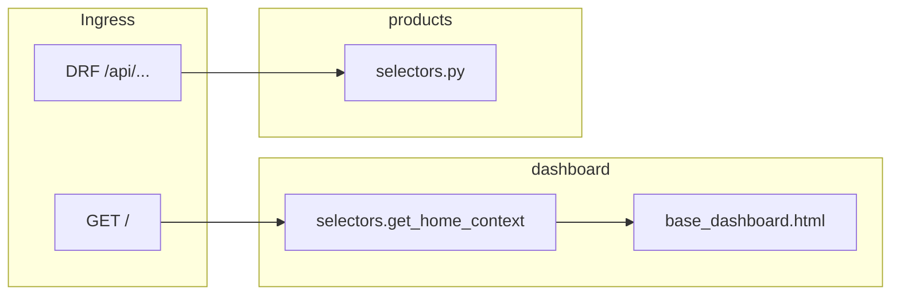

# Single-Tenant Frontend Consolidation — Handoff & Progress

Use this document to resume work in a **new agent session** without re-deriving context. Read [`.cursor/rules/consolidated-frontend.mdc`](../../.cursor/rules/consolidated-frontend.mdc) before changing backend code.

Optional: attach the Cursor plan `frontend_consolidation_roadmap` for full narrative; **this file is the in-repo source of truth** for status and next steps.

---

## Current next action

**Do Phase 2 for `products`** — HTML pages extending the shared dashboard shell.

1. Add [`backend/products/template_views.py`](../../backend/products/template_views.py) with `@login_required`; call [`products/selectors.py`](../../backend/products/selectors.py) only.
2. Add [`backend/products/templates/products/`](../../backend/products/templates/products/) — extend [`backend/templates/base_dashboard.html`](../../backend/templates/base_dashboard.html).
3. Mount HTML at `/products/` in [`backend/products/urls.py`](../../backend/products/urls.py) (separate from DRF router).
4. Update sidebar in [`backend/templates/includes/sidebar.html`](../../backend/templates/includes/sidebar.html) when `/products/` exists.
5. Run `dashboard.tests` + `products.tests.ProductsAPITests`; update this doc with commit SHA.

---

## Topological workflow (per app)

```text
dashboard home (done) → products P2 (next) → entities P1+P2 → …
```

Complete **Phase 1 → Phase 2** per app after the shared layout exists. Do **not** delete Next.js routes (Phase 5) or the frontend Docker service (Phase 6) until HTML is verified.

See also [`docs/APPS.md`](../APPS.md).

---

## Layer conventions (mandatory)

| Module | Responsibility | Used by |
|--------|----------------|---------|
| `selectors.py` | Read-only: querysets, aggregates, dashboard dicts | DRF, `template_views` |
| `services.py` | Writes: mutations, transactions | DRF actions, POST handlers |

Rules: single Django process; preserve `/api/...` DRF; no HTTP loopback from templates; shared selectors; `` for app pages.

---

## Global phases

| Phase | Description | Status |
|-------|-------------|--------|
| 0 | This tracking document | done |
| 1 | Service/selector extraction per app | in_progress — `products` done |
| 2 | Django template views per app | pending — **`products` next** |
| 3 | Shared base layout + Tailwind CSS | **done** — [`base_dashboard.html`](../../backend/templates/base_dashboard.html), compiled [`static/dist/styles.css`](../../backend/static/dist/styles.css) |
| 4 | Session auth on HTML | **partial done** — `/login/`, `@login_required` on `/` |
| 5 | Remove Next.js routes per app | pending |
| 6 | Docker/docs cleanup | pending |

---

## Dashboard home (milestone complete)

Replaces [`frontend/src/app/page.tsx`](../../frontend/src/app/page.tsx) (mock stats/actions/activity).

| Item | Location |
|------|----------|
| App | [`backend/dashboard/`](../../backend/dashboard/) |
| Selector | [`dashboard/selectors.py`](../../backend/dashboard/selectors.py) → `get_home_context()` (v1 static; v2 real counts later) |
| View | [`dashboard/template_views.py`](../../backend/dashboard/template_views.py) → `home` |
| Templates | [`backend/templates/base_dashboard.html`](../../backend/templates/base_dashboard.html), [`templates/dashboard/home.html`](../../backend/templates/dashboard/home.html), [`templates/includes/`](../../backend/templates/includes/) |
| CSS source | [`backend/static/src/input.css`](../../backend/static/src/input.css) (shadcn tokens + dashboard layout) |
| CSS output | [`backend/static/dist/styles.css`](../../backend/static/dist/styles.css) via Tailwind v3 CLI |
| Tests | [`dashboard/tests.py`](../../backend/dashboard/tests.py) |

### URLs

| Path | Handler |
|------|---------|
| `/` | HTML dashboard (`dashboard:home`) — requires login |
| `/login/` | Session login |
| `/logout/` | Session logout (POST) |
| `/api/` | JSON API catalog (`api-catalog`) — was JSON at `/` before migration |

**Note:** URL name `api-catalog` avoids clash with DRF router `api-root` from [`our_institution`](../../backend/our_institution/urls.py).

### Access

- **Django CRM UI:** http://localhost:8000/ (after `docker-compose up backend`)
- **Next.js (legacy):** http://localhost:3000/ until Phase 5

### Commit

`4d7334b` — feat(dashboard): migrate homepage to Django templates at /

---

## App rollout

| App | Phase 1 | Phase 2 | Notes |
|-----|---------|---------|-------|
| **dashboard** | n/a | home done | Shared shell for all apps |
| **products** | done | **next** | P1: `87ac531`, `fb3ded6` |
| entities | pending | pending | — |
| interactions | pending | pending | — |
| campaigns | pending | pending | — |
| offers | pending | pending | — |

---

## `products` app reference

### URLs

| Surface | Prefix |
|---------|--------|
| REST API | `/api/products/` |
| HTML (Phase 2) | `/products/` (proposed) |

### Phase 2 selectors (examples)

| Page | Selector(s) |
|------|-------------|
| Products dashboard | `get_product_analytics_dashboard()`, `get_product_recommendations()` |
| Product list | `products_list_queryset(action='list')` |
| Product detail | `get_bundle_info(product)`, etc. |

See [`backend/products/selectors.py`](../../backend/products/selectors.py).

### Next.js to retire later (Phase 5)

- [`frontend/src/app/page.tsx`](../../frontend/src/app/page.tsx) — superseded by Django `/`
- [`frontend/src/app/products/page.tsx`](../../frontend/src/app/products/page.tsx)
- [`frontend/src/app/products/[id]/page.tsx`](../../frontend/src/app/products/[id]/page.tsx)

---

## Tailwind build (Phase 3)

Toolchain lives under [`backend/`](../../backend/): [`package.json`](../../backend/package.json), [`tailwind.config.js`](../../backend/tailwind.config.js) (theme ported from [`frontend/tailwind.config.js`](../../frontend/tailwind.config.js)).

```bash
cd backend
npm install
npm run tailwind:build    # writes static/dist/styles.css (minified)
npm run tailwind:watch    # local dev rebuild
```

- **Templates** load `` only (no separate `dashboard.css`).
- **`static/dist/styles.css`** is gitignored (`dist/` in root `.gitignore`); run `tailwind:build` locally or rely on Docker/CI (`Dockerfile`, `Dockerfile.prod` builder stage).
- **docker-compose dev** mounts `./backend:/app`, which overwrites image-built `static/dist/` — run `npm run tailwind:build` (or `tailwind:watch`) on the host when styling changes.

Production images run `npm ci`, `tailwind:build`, and `collectstatic` in the `Dockerfile.prod` builder; runtime remains a single Python process (`entrypoint.sh` may re-run `collectstatic` idempotently).

---

## Verification / test gate

```bash
cd backend && npm install && npm run tailwind:build

docker build -f backend/Dockerfile -t backboneos-test backend

# Dashboard + products API regression (13 tests):
docker run --rm -v "$(pwd)/backend:/app" -w /app \
  -e DJANGO_SETTINGS_MODULE=backend.test_settings \
  backboneos-test python manage.py test dashboard.tests products.tests.ProductsAPITests
```

`manage.py check` should report no issues.

### Known test debt (not blocking)

- Full `products` suite: Division fixtures, analytics JSON drift — see earlier notes.
- HTML tests use `backend.test_settings` (SQLite + simple staticfiles storage).

---

## Phase 2 checklist (`products`)

- [ ] `template_views.py` + selectors only
- [ ] `templates/products/*.html` extend `base_dashboard.html`
- [ ] `/products/` URL mount
- [ ] Sidebar Products link → Django URL
- [ ] `ProductsAPITests` + `dashboard.tests` green
- [ ] Doc updated with commit SHA

---

## Architecture


