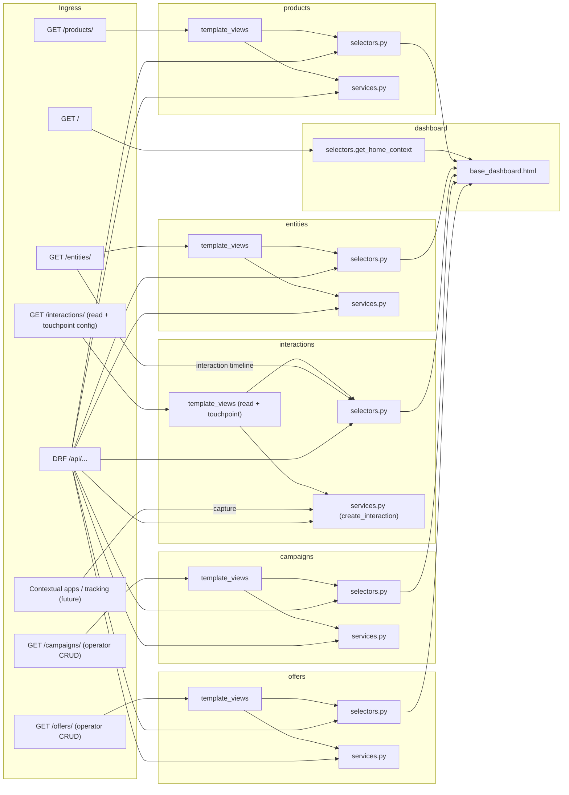

# Single-Tenant Frontend Consolidation — Handoff & Progress

Use this document to resume work in a **new agent session** without re-deriving context. Read [`.cursor/rules/consolidated-frontend.mdc`](../../.cursor/rules/consolidated-frontend.mdc) before changing backend code.

Optional: attach the Cursor plan `frontend_consolidation_roadmap` for full narrative; **this file is the in-repo source of truth** for status and next steps.

---

## Current next action

**Phase 5 is complete** for dashboard, products, and entities (see [Phase 5 checklist](#phase-5-checklist-dashboard--products--entities)). Next: **Phase 6** — remove the `frontend` Docker service, decommission the Next.js package, and sweep remaining docs (`docs/FRONTEND.md`, hybrid-dev README sections).

Stance recap:
- **Interactions** = substrate (read-only + touchpoint config); capture via `services.create_interaction`.
- **Campaigns** = operator CRUD for planned commercial structures and campaign–touchpoint links (not a substrate).
- **Offers** = operator CRUD for `ProductOffering` (commercial pricing / targeting configuration).

**Remaining on Next.js (:3000) until Phase 6:** `/users`, `/analytics`, `/login`, `/settings` (if added). CRM modules use Django at `:8000` (sidebar links via `NEXT_PUBLIC_DJANGO_UI_BASE`).

---

## Topological workflow (per app)

```text
dashboard home (done) → products P2 (done) → entities P1+P2 (done) → interactions (done, substrate) → campaigns (done, CRUD) → offers (done, CRUD) → manual QA (done) → **Phase 5** (done) → **Phase 6** (Docker/docs)
```

Complete **Phase 1 → Phase 2** per app after the shared layout exists. Do **not** delete Next.js routes (Phase 5) or the frontend Docker service (Phase 6) until HTML is verified.

See also [`docs/APPS.md`](../APPS.md).

---

## Layer conventions (mandatory)

| Module | Responsibility | Used by |
|--------|----------------|---------|
| `selectors.py` | Read-only: querysets, aggregates, dashboard dicts | DRF, `template_views` |
| `services.py` | Writes: mutations, transactions | DRF actions, POST handlers |

Rules: single Django process; preserve `/api/...` DRF; no HTTP loopback from templates; shared selectors; `` for app pages.

---

## Global phases

| Phase | Description | Status |
|-------|-------------|--------|
| 0 | This tracking document | done |
| 1 | Service/selector extraction per app | **done** — **`products`**, **`entities`**, **`interactions`**, **`campaigns`**, **`offers`** |
| 2 | Django template views per app | **done** — **`products`**, **`entities`**, **`interactions`**, **`campaigns`**, **`offers`** |
| 3 | Shared base layout + Tailwind CSS | **done** — [`base_dashboard.html`](../../backend/templates/base_dashboard.html), compiled [`static/dist/styles.css`](../../backend/static/dist/styles.css) |
| 4 | Session auth on HTML | **partial done** — `/login/`, `@login_required` on `/`, `/products/`, `/entities/`, `/interactions/`, `/campaigns/`, `/offers/` |
| 5 | Remove Next.js routes per app | **done** — dashboard landing + redirects; `products/**`, `entities/**` removed; `api.ts` pruned |
| 6 | Docker/docs cleanup | **next** — remove `frontend` service from Compose; delete Next package |

---

## Dashboard home (milestone complete)

Replaces [`frontend/src/app/page.tsx`](../../frontend/src/app/page.tsx) (mock stats/actions/activity).

| Item | Location |
|------|----------|
| App | [`backend/dashboard/`](../../backend/dashboard/) |
| Selector | [`dashboard/selectors.py`](../../backend/dashboard/selectors.py) → `get_home_context()` (v1 static; v2 real counts later) |
| View | [`dashboard/template_views.py`](../../backend/dashboard/template_views.py) → `home` |
| Templates | [`backend/templates/base_dashboard.html`](../../backend/templates/base_dashboard.html), [`templates/dashboard/home.html`](../../backend/templates/dashboard/home.html), [`templates/includes/`](../../backend/templates/includes/) |
| CSS source | [`backend/static/src/input.css`](../../backend/static/src/input.css) (shadcn tokens + dashboard layout) |
| CSS output | [`backend/static/dist/styles.css`](../../backend/static/dist/styles.css) via Tailwind v3 CLI |
| Tests | [`dashboard/tests.py`](../../backend/dashboard/tests.py) |

### URLs

| Path | Handler |
|------|---------|
| `/` | HTML dashboard (`dashboard:home`) — requires login |
| `/login/` | Session login |
| `/logout/` | Session logout (POST) |
| `/api/` | JSON API catalog (`api-catalog`) — was JSON at `/` before migration |

**Note:** URL name `api-catalog` avoids clash with DRF router `api-root` from [`our_institution`](../../backend/our_institution/urls.py).

### Access

- **Django CRM UI:** http://localhost:8000/ (after `docker-compose up backend`)
- **Products CRM (Django):** http://localhost:8000/products/ — requires login
- **Entities CRM (Django):** http://localhost:8000/entities/ — requires login
- **Offers CRM (Django):** http://localhost:8000/offers/ — requires login
- **Next.js (partial, Phase 6):** http://localhost:3000/ — landing + `/users`, `/analytics`, `/login`; `/products` and `/entities` redirect to Django

### Commit

`4d7334b` — feat(dashboard): migrate homepage to Django templates at /

---

## Products HTML (Phase 2 complete)

Replaces [`frontend/src/app/products/page.tsx`](../../frontend/src/app/products/page.tsx) and [`frontend/src/app/products/[id]/page.tsx`](../../frontend/src/app/products/[id]/page.tsx).

| Item | Location |
|------|----------|
| Reads | [`products/selectors.py`](../../backend/products/selectors.py) — `get_products_list_context`, `get_product_detail_context`, `get_product_form_options` |
| Writes | [`products/services.py`](../../backend/products/services.py) — `create_product`, `update_product`, `delete_product` (shared with DRF) |
| Forms | [`products/forms.py`](../../backend/products/forms.py) |
| Views | [`products/template_views.py`](../../backend/products/template_views.py) |
| URLconf | [`products/template_urls.py`](../../backend/products/template_urls.py) — namespace `products_html` |
| Templates | [`products/templates/products/`](../../backend/products/templates/products/) — `list.html`, `create.html`, `detail.html` |
| Tests | [`products/tests_template_views.py`](../../backend/products/tests_template_views.py) |

### URLs

| Path | Handler |
|------|---------|
| `/products/` | List + filters + pagination (`products_html:list`) |
| `/products/new/` | Create (`products_html:create`) |
| `/products/<uuid>/` | Detail + full edit form (`products_html:detail`) |
| `/products/<uuid>/delete/` | POST delete (`products_html:delete`) |
| `/api/products/` | DRF (unchanged) |

### Access

- http://localhost:8000/products/ (list)
- http://localhost:8000/products/new/ (create)
- Sidebar **Products** → `products_html:list`; dashboard quick action **Add Product** → `/products/new/`

### DRF integration

`ProductViewSet` delegates mutations to [`services.py`](../../backend/products/services.py) via `perform_create`, `perform_update`, and `perform_destroy` (`product_write_payload_from_request` merges serializer data with `*_ids` from the request body). M2M write logic was removed from [`serializers.py`](../../backend/products/serializers.py) to avoid duplication.

### UI notes

- Flash messages: [`base_dashboard.html`](../../backend/templates/base_dashboard.html) (`django.contrib.messages`)
- Products-specific CSS: `/* Products CRM */` block in [`input.css`](../../backend/static/src/input.css) (tables, forms, badges, `<details>` sections)

### Commit

`8091756` — feat(products): implement products management UI and backend integration

---

## Entities HTML (Phase 2 complete)

Replaces [`frontend/src/app/entities/page.tsx`](../../frontend/src/app/entities/page.tsx), [`frontend/src/app/entities/people/[id]/page.tsx`](../../frontend/src/app/entities/people/[id]/page.tsx), and [`frontend/src/app/entities/organizations/[id]/page.tsx`](../../frontend/src/app/entities/organizations/[id]/page.tsx).

| Item | Location |
|------|----------|
| Reads | [`entities/selectors.py`](../../backend/entities/selectors.py) — `get_entities_list_context`, `get_person_detail_context`, `get_organization_detail_context`, `get_entities_form_options` |
| Writes | [`entities/services.py`](../../backend/entities/services.py) — person/org CRUD, `create_individual_profile` (shared with DRF) |
| Forms | [`entities/forms.py`](../../backend/entities/forms.py) |
| Views | [`entities/template_views.py`](../../backend/entities/template_views.py) |
| URLconf | [`entities/template_urls.py`](../../backend/entities/template_urls.py) — namespace `entities_html` |
| Templates | [`entities/templates/entities/`](../../backend/entities/templates/entities/) — `list.html`, `person_create.html`, `person_detail.html`, `organization_create.html`, `organization_detail.html` |
| Tests | [`entities/tests_template_views.py`](../../backend/entities/tests_template_views.py) |

### URLs

| Path | Handler |
|------|---------|
| `/entities/` | Tabbed list (`?tab=people\|organizations`) — `entities_html:list` |
| `/entities/people/new/` | Create person (`entities_html:person_create`) |
| `/entities/people/<uuid>/` | Person detail + edit (`entities_html:person_detail`) |
| `/entities/people/<uuid>/create-profile/` | POST create profile (`entities_html:person_create_profile`) |
| `/entities/people/<uuid>/delete/` | POST delete person (`entities_html:person_delete`) |
| `/entities/organizations/new/` | Create org (`entities_html:org_create`) |
| `/entities/organizations/<uuid>/` | Org detail + edit (`entities_html:org_detail`) |
| `/entities/organizations/<uuid>/delete/` | POST delete org (`entities_html:org_delete`) |
| `/api/entities/` | DRF (unchanged) |

### Access

- http://localhost:8000/entities/ (list)
- http://localhost:8000/entities/people/new/ (create person)
- Sidebar **Entities** → `entities_html:list`; dashboard quick action **Add Entity** → `/entities/people/new/`

### DRF integration

`PersonViewSet` and `OrganizationViewSet` delegate mutations to [`services.py`](../../backend/entities/services.py) via `perform_create`, `perform_update`, and `perform_destroy`. Document uniqueness validation lives in `validate_person_document` / `validate_organization_document` (called from serializers and services). `create_profile` action uses `create_individual_profile`.

### UI notes

- Tabbed people/organizations list (query param `tab`, same UX as Next.js single `/entities` route)
- Read-only contacts, addresses, and profile summary on person detail; **Crear perfil** POST (wired; was dead in Next.js)
- Org detail uses FK `<select>` widgets (improvement over Next.js text inputs)
- Entities-specific CSS: `/* Entities CRM */` block in [`input.css`](../../backend/static/src/input.css)

### Deferred (follow-up, not blocking Phase 5)

- Contact/address CRUD forms on organization detail
- Full `IndividualProfile` M2M editor (industries, skills, functions)
- List `search_semantic` and extra filter dropdowns (API-ready; Next list did not use them)

### Commit

`fd57b8d` — feat(entities): implement entities management UI and backend integration

---

## Interactions HTML (Phase 2 — substrate stance)

**Stance:** interactions are a **system-of-record substrate**, not an end-user data-entry destination. Capture happens in contextual apps (sales/support) and tracking scripts via `services.create_interaction` (and the unchanged DRF API). The dashboard section is intentionally thin.

| Item | Location |
|------|----------|
| Reads | [`interactions/selectors.py`](../../backend/interactions/selectors.py) — `get_interactions_hub_context`, `get_interaction_detail_context` (read-only), `get_interaction_analytics_summary`, `get_touchpoint_detail_context`, `get_touchpoint_form_options`, **`get_entity_interactions_timeline`** |
| Writes | [`interactions/services.py`](../../backend/interactions/services.py) — `create_interaction`/`update_interaction`/`delete_interaction` (API + future contextual apps), `create_touchpoint`/`update_touchpoint`/`delete_touchpoint` (HTML + API), `validate_interaction_entities`, `apply_interaction_defaults` |
| Forms | [`interactions/forms.py`](../../backend/interactions/forms.py) — **Touchpoint only** (no interaction hand-entry form) |
| Views | [`interactions/template_views.py`](../../backend/interactions/template_views.py) |
| URLconf | [`interactions/template_urls.py`](../../backend/interactions/template_urls.py) — namespace `interactions_html` |
| Templates | [`interactions/templates/interactions/`](../../backend/interactions/templates/interactions/) — `list.html`, `interaction_detail.html` (read-only), `touchpoint_create.html`, `touchpoint_detail.html`, `_touchpoint_form_fields.html` |
| Entity timeline | [`entities/templates/entities/_interactions_timeline.html`](../../backend/entities/templates/entities/_interactions_timeline.html) included on person/org detail |
| Tests | [`interactions/tests_template_views.py`](../../backend/interactions/tests_template_views.py), [`interactions/test_factories.py`](../../backend/interactions/test_factories.py) |

### URLs

| Path | Handler |
|------|---------|
| `/interactions/` | Tabbed hub (`?tab=interactions\|touchpoints`) — `interactions_html:list` |
| `/interactions/<uuid>/` | **Read-only** interaction detail (`interactions_html:interaction_detail`) |
| `/interactions/touchpoints/new/` | Create touchpoint (`interactions_html:touchpoint_create`) |
| `/interactions/touchpoints/<uuid>/` | Touchpoint detail + edit (`interactions_html:touchpoint_detail`) |
| `/interactions/touchpoints/<uuid>/delete/` | POST delete touchpoint (`interactions_html:touchpoint_delete`) |
| `/api/interactions/` | DRF (unchanged) |

There is **no** interaction create/edit/delete HTML route — by design.

### Access

- http://localhost:8000/interactions/ (hub: read-only interactions + touchpoint config)
- Per-customer timeline on http://localhost:8000/entities/people/<uuid>/ and `/entities/organizations/<uuid>/`
- Sidebar **Interactions** → `interactions_html:list`; dashboard quick action **Log Interaction** demoted to "Coming soon" (logging is contextual)

### DRF integration

`InteractionViewSet` and `TouchpointViewSet` delegate mutations to [`services.py`](../../backend/interactions/services.py) via `perform_create`/`perform_update`/`perform_destroy`; `get_queryset` and `analytics` delegate to selectors. Interaction entity-or-agent validation lives in `validate_interaction_entities` (shared by serializer `validate` and the service). Fixed a pre-existing DRF issue: `TouchpointCreateUpdateSerializer` forced `url` required via `unique_together(['code','url'])`; added `code`/`url` serializer defaults to honor the model's `blank=True`.

### UI notes

- Read-only interaction detail shows resolved entity, touchpoint/channel, technical context, and `payload`/`metadata`.
- Touchpoint detail lists recent interactions inline (no REST loopback).
- Per-entity timeline ORs direct + agent-resolved relations to mirror `resolved_person`/`resolved_organization`.
- Interactions-specific CSS: `/* Interactions CRM */` block in [`input.css`](../../backend/static/src/input.css).

### Deferred (follow-up)

- **Contextual capture UIs** (sales/support) calling `create_interaction` — the intended logging experience.
- Lookup catalog HTML (Medium, Channel, ActionType, Action, Agent, TouchpointType) — currently DRF + Django admin.
- Touchpoint world-M2M editor (industries/functions/skills/descriptors); date-range filter; geographic map; richer analytics page.
- Timeline pagination / date filtering on entity pages (currently latest 25).

### Commit

`c895c21` — feat(interactions): implement interactions management UI and backend integration (substrate: read-only interaction HTML + touchpoint config + per-entity timeline)

---

## Campaigns HTML (Phase 2 complete)

**Stance:** campaigns are **operator-editable configuration** (planned marketing structures). The dashboard provides full **Campaign** CRUD and **CampaignTouchpoint** junction CRUD. Interaction logging remains in contextual apps / the interactions substrate.

| Item | Location |
|------|----------|
| Reads | [`campaigns/selectors.py`](../../backend/campaigns/selectors.py) — `get_campaigns_hub_context`, `get_campaign_detail_context`, `get_campaign_analytics_overview`, `get_campaign_analytics_full`, touchpoint list/detail contexts |
| Writes | [`campaigns/services.py`](../../backend/campaigns/services.py) — `create_campaign`, `update_campaign`, `delete_campaign`, `duplicate_campaign`, campaign–touchpoint CRUD, shared `validate_*` |
| Forms | [`campaigns/forms.py`](../../backend/campaigns/forms.py) |
| Views | [`campaigns/template_views.py`](../../backend/campaigns/template_views.py) |
| URLconf | [`campaigns/template_urls.py`](../../backend/campaigns/template_urls.py) — namespace `campaigns_html` |
| Templates | [`campaigns/templates/campaigns/`](../../backend/campaigns/templates/campaigns/) — `list.html`, `create.html`, `detail.html`, `touchpoint_create.html`, `touchpoint_detail.html` |
| Tests | [`campaigns/tests_template_views.py`](../../backend/campaigns/tests_template_views.py), [`campaigns/test_factories.py`](../../backend/campaigns/test_factories.py) |

### URLs

| Path | Handler |
|------|---------|
| `/campaigns/` | Tabbed hub (`?tab=campaigns\|touchpoints`) — `campaigns_html:list` |
| `/campaigns/new/` | Create campaign (`campaigns_html:create`) |
| `/campaigns/<uuid>/` | Campaign detail + edit (`campaigns_html:detail`) |
| `/campaigns/<uuid>/delete/` | POST delete campaign (`campaigns_html:delete`) |
| `/campaigns/touchpoints/new/` | Create campaign–touchpoint link (`campaigns_html:touchpoint_create`) |
| `/campaigns/touchpoints/<int>/` | Link detail + edit (`campaigns_html:touchpoint_detail`) |
| `/campaigns/touchpoints/<int>/delete/` | POST delete link (`campaigns_html:touchpoint_delete`) |
| `/api/campaigns/` | DRF (unchanged) |

Note: `CampaignTouchpoint` uses integer PK; campaign routes use UUID.

### Access

- http://localhost:8000/campaigns/ (hub)
- http://localhost:8000/campaigns/new/ (create)
- Sidebar **Campaigns** → `campaigns_html:list`
- No Next.js `/campaigns` page yet (API client in [`frontend/src/lib/api.ts`](../../frontend/src/lib/api.ts) only)

### DRF integration

`CampaignViewSet` and `CampaignTouchpointViewSet` delegate mutations to [`services.py`](../../backend/campaigns/services.py) via `perform_create` / `perform_update` / `perform_destroy`. `get_queryset` and `analytics` delegate to selectors. `duplicate` action calls `duplicate_campaign`. Serializer `create`/`update` removed from write serializers; validation calls shared `validate_*` helpers.

### UI notes

- Tabbed hub mirrors interactions: campaigns table + campaign–touchpoint links table.
- Analytics overview cards on list (totals, active, scheduled, budget).
- Detail page: subcampaigns list, linked touchpoints, targeting summary, M2M for channels/products/categories/offers.
- Campaigns-specific CSS: `/* Campaigns CRM */` block in [`input.css`](../../backend/static/src/input.css).

### Deferred (follow-up)

- World semantic M2M editor (industries, functions, segments, descriptors, tags) on campaign detail.
- Subcampaign inline create from parent detail.
- Duplicate campaign button in HTML (API `duplicate` action remains).
- Rich analytics HTML (`product_analytics`, `bundle_analytics`); use API or later page.
- `metadata` JSON editor on campaign detail.

### Commit

`95c7e0b` — feat(campaigns): implement campaigns management UI and backend integration

---

## Offers HTML (Phase 2 complete)

**Stance:** offers are **operator-editable commercial configuration** (`ProductOffering`). The dashboard provides full CRUD. There is **no** legacy Next.js `/offers` page — only the API client in [`frontend/src/lib/api.ts`](../../frontend/src/lib/api.ts).

| Item | Location |
|------|----------|
| Reads | [`offers/selectors.py`](../../backend/offers/selectors.py) — `get_offerings_list_context`, `get_offering_detail_context`, `get_offering_form_options`, `get_offering_analytics_overview`, `get_offering_analytics_full` |
| Writes | [`offers/services.py`](../../backend/offers/services.py) — `create_offering`, `update_offering`, `delete_offering`, `duplicate_offering`, shared `validate_*` |
| Forms | [`offers/forms.py`](../../backend/offers/forms.py) |
| Views | [`offers/template_views.py`](../../backend/offers/template_views.py) |
| URLconf | [`offers/template_urls.py`](../../backend/offers/template_urls.py) — namespace `offers_html` |
| Templates | [`offers/templates/offers/`](../../backend/offers/templates/offers/) — `list.html`, `create.html`, `detail.html` |
| Tests | [`offers/tests_template_views.py`](../../backend/offers/tests_template_views.py), [`offers/test_factories.py`](../../backend/offers/test_factories.py) |

### URLs

| Path | Handler |
|------|---------|
| `/offers/` | List + filters + pagination + overview cards (`offers_html:list`) |
| `/offers/new/` | Create (`offers_html:create`) |
| `/offers/<uuid>/` | Detail + full edit form (`offers_html:detail`) |
| `/offers/<uuid>/delete/` | POST delete (`offers_html:delete`) |
| `/api/offers/offerings/` | DRF (unchanged) |

### Access

- http://localhost:8000/offers/ (list)
- http://localhost:8000/offers/new/ (create)
- Sidebar **Offers** → `offers_html:list`

### DRF integration

`ProductOfferingViewSet` delegates mutations to [`services.py`](../../backend/offers/services.py) via `perform_create` / `perform_update` / `perform_destroy`. `get_queryset` and `analytics` delegate to selectors. `duplicate` calls `duplicate_offering`. Serializer validation calls shared `validate_*` helpers. UUID `lookup_value_regex` prevents custom action paths (e.g. `export/`) from matching the detail route.

### UI notes

- List: overview cards (total, active, expired, future), filters (product, category, currency, validity, active), discount badge when below product base price.
- Detail: `<details>` sections for pricing/dates, channels/seats, segmentation M2M, tags/descriptors.
- Offers-specific CSS: `/* Offers CRM */` block in [`input.css`](../../backend/static/src/input.css).

### Deferred (follow-up)

- Duplicate button in HTML (API `duplicate` action remains).
- `bulk_create`, CSV/JSON `export`, rich analytics HTML page.
- `metadata` JSON editor on detail.
- World semantic M2M UX beyond checkbox lists.

### Commit

`94c6ba9` — feat(offers): implement offers management UI and backend integration

---

## App rollout

| App | Phase 1 | Phase 2 | Notes |
|-----|---------|---------|-------|
| **dashboard** | n/a | home done | Shared shell for all apps |
| **products** | done | **done** | P1: `87ac531`, `fb3ded6`; P2: `8091756` |
| **entities** | **done** | **done** | P2: `fd57b8d` |
| **interactions** | **done** | **done** | Substrate stance; P2: `c895c21` |
| **campaigns** | **done** | **done** | Operator CRUD; P2: `95c7e0b`; no Next page to retire |
| **offers** | **done** | **done** | Operator CRUD; P2: `94c6ba9`; no Next page to retire |

---

## `products` app reference

### URLs

| Surface | Prefix |
|---------|--------|
| REST API | `/api/products/` |
| HTML | `/products/` (`products_html` namespace) |

### Phase 2 selectors (in use)

| Page | Selector(s) |
|------|-------------|
| Product list | `get_products_list_context()` → `products_list_queryset`, `get_product_analytics_dashboard()['overview']` |
| Product detail | `get_product_detail_context()` → `get_bundle_info` |
| Forms | `get_product_form_options()` |

### Next.js retired (Phase 5)

Removed or replaced:

- [`frontend/src/app/page.tsx`](../../frontend/src/app/page.tsx) — CRM landing with link to Django `/` (mock dashboard removed)
- `frontend/src/app/products/**` — deleted; `next.config.js` redirects to Django `/products/`
- `frontend/src/app/entities/**` — deleted; redirects to Django `/entities/`
- [`frontend/src/lib/api.ts`](../../frontend/src/lib/api.ts) — `authApi` + `usersApi` only; CRM client stubs removed
- [`frontend/src/lib/django-ui.ts`](../../frontend/src/lib/django-ui.ts) — `NEXT_PUBLIC_DJANGO_UI_BASE` helper for sidebar/external links

---

## Phase 5 checklist (dashboard + products + entities)

- [x] Django template test gate green before deletions (51 tests in consolidated gate subset)
- [x] `next.config.js` redirects `/products`, `/products/:path*`, `/entities`, `/entities/:path*` → Django UI base
- [x] Root `page.tsx` replaced with Phase 5 landing (not mock dashboard)
- [x] Orphan dashboard components removed (`dashboard-stats`, `quick-actions`, `recent-activity`)
- [x] Next `products/**` and `entities/**` pages deleted
- [x] Sidebar: Django external links for CRM; Next internal links for users/analytics
- [x] `api.ts` pruned; `__mocks__/api.ts` uses local test-only types
- [x] `.env.example` documents `NEXT_PUBLIC_DJANGO_UI_BASE`
- [x] Manual verification: `:3000/products` → `:8000/products/`; `:3000/users` still loads
- [x] `npm run build` passes (routes: `/`, `/users`, `/analytics`, `/login` only)
- [ ] Frontend test debt: `AuthContext` / `TokenRefreshManager` tests drift from cookie-based auth (not blocking Phase 5)
- [ ] Commit hash: _(add after commit)_

---

## `entities` app reference

### URLs

| Surface | Prefix |
|---------|--------|
| REST API | `/api/entities/` |
| HTML | `/entities/` (`entities_html` namespace) |

### Phase 2 selectors (in use)

| Page | Selector(s) |
|------|-------------|
| Entity list | `get_entities_list_context()` — tabbed people/orgs, search, pagination |
| Person detail | `get_person_detail_context()` — contacts, addresses, profile summary |
| Organization detail | `get_organization_detail_context()` |
| Forms | `get_entities_form_options()` |

---

## Tailwind build (Phase 3)

Toolchain lives under [`backend/`](../../backend/): [`package.json`](../../backend/package.json), [`tailwind.config.js`](../../backend/tailwind.config.js) (theme ported from [`frontend/tailwind.config.js`](../../frontend/tailwind.config.js)).

```bash
cd backend
npm install
npm run tailwind:build    # writes static/dist/styles.css (minified)
npm run tailwind:watch    # local dev rebuild
```

- **Templates** load `` only (no separate `dashboard.css`).
- **`static/dist/styles.css`** is gitignored (`dist/` in root `.gitignore`); run `tailwind:build` locally or rely on Docker/CI (`Dockerfile`, `Dockerfile.prod` builder stage).
- **docker-compose dev** mounts `./backend:/app`, which overwrites image-built `static/dist/` — run `npm run tailwind:build` (or `tailwind:watch`) on the host when styling changes.

Production images run `npm ci`, `tailwind:build`, and `collectstatic` in the `Dockerfile.prod` builder; runtime remains a single Python process (`entrypoint.sh` may re-run `collectstatic` idempotently).

---

## Verification / test gate

```bash
cd backend && npm install && npm run tailwind:build

docker build -f backend/Dockerfile -t backboneos-test backend

# Dashboard + products + entities + interactions + campaigns + offers API + HTML:
docker run --rm -v "$(pwd)/backend:/app" -w /app \
  -e DJANGO_SETTINGS_MODULE=backend.test_settings \
  backboneos-test python manage.py test \
    dashboard.tests \
    products.tests.ProductsAPITests products.tests_template_views \
    entities.tests.PersonAPITest entities.tests.OrganizationAPITest \
    entities.tests.PersonViewSetTests entities.tests.OrganizationViewSetTests \
    entities.tests_template_views \
    interactions.tests.InteractionAPITests interactions.tests.TouchpointAPITests \
    interactions.tests_template_views \
    campaigns.tests campaigns.tests_template_views \
    offers.tests offers.tests_template_views
```

With docker-compose running, the equivalent is:

```bash
docker compose run --rm -e DJANGO_SETTINGS_MODULE=backend.test_settings backend \
  python manage.py test dashboard.tests \
    interactions.tests.InteractionAPITests interactions.tests.TouchpointAPITests \
    interactions.tests_template_views entities.tests_template_views \
    campaigns.tests campaigns.tests_template_views \
    offers.tests offers.tests_template_views
```

The consolidated gate (dashboard + interactions + entities + campaigns + offers HTML) reports **67 tests, OK**.

`manage.py check` should report no issues.

### Known test debt (not blocking)

- Full `products` suite: Division fixtures, analytics JSON drift — see earlier notes.
- HTML tests use `backend.test_settings` (SQLite + simple staticfiles storage).

---

## Phase 2 checklist (`products`)

- [x] `template_views.py` + selectors only (writes via `services.py`)
- [x] `templates/products/*.html` extend `base_dashboard.html`
- [x] `/products/` URL mount (`products.template_urls`, not DRF `urls.py`)
- [x] Sidebar Products link → `products_html:list`
- [x] `ProductsAPITests` + `dashboard.tests` + `tests_template_views` green
- [x] Doc updated — commit `8091756`
- [x] Manual verification complete

---

## Phase 2 checklist (`entities`)

- [x] `selectors.py` + `services.py`; DRF `perform_*` delegation
- [x] `template_views.py` + `forms.py` (writes via `services.py`)
- [x] `templates/entities/*.html` extend `base_dashboard.html`
- [x] `/entities/` URL mount (`entities.template_urls`, namespace `entities_html`)
- [x] Sidebar Entities link → `entities_html:list`
- [x] `dashboard.tests` + entities API subset + `tests_template_views` green (33 tests in gate)
- [x] Doc updated — commit `fd57b8d`
- [x] Manual verification complete

---

## Phase 2 checklist (`interactions` — substrate stance)

- [x] `selectors.py` + `services.py`; DRF `perform_*` delegation on Interaction + Touchpoint viewsets
- [x] Interaction HTML is **read-only** (list + detail + analytics); no create/edit/delete views
- [x] Touchpoint config CRUD via `template_views.py` + `forms.py` (writes via `services.py`)
- [x] Per-entity interaction timeline (`get_entity_interactions_timeline`) on entities person/org detail
- [x] `templates/interactions/*.html` extend `base_dashboard.html`
- [x] `/interactions/` URL mount (`interactions.template_urls`, namespace `interactions_html`)
- [x] Sidebar Interactions link → `interactions_html:list`; dashboard quick action demoted
- [x] `interactions` API subset + `tests_template_views` + entity timeline + `dashboard.tests` green (37 tests)
- [x] Doc updated — commit `c895c21`
- [x] Manual verification complete

---

## Phase 2 checklist (`campaigns` — operator CRUD)

- [x] `selectors.py` + `services.py`; DRF `perform_*` delegation on Campaign + CampaignTouchpoint viewsets
- [x] `template_views.py` + `forms.py` (writes via `services.py`)
- [x] Tabbed hub: campaigns + campaign–touchpoint links
- [x] `templates/campaigns/*.html` extend `base_dashboard.html`
- [x] `/campaigns/` URL mount (`campaigns.template_urls`, namespace `campaigns_html`)
- [x] Sidebar Campaigns link → `campaigns_html:list`
- [x] `campaigns.tests` + `tests_template_views` + `dashboard.tests` green (47 tests in gate)
- [x] Doc updated — commit `95c7e0b`
- [x] Manual verification complete

---

## Phase 2 checklist (`offers` — operator CRUD)

- [x] `selectors.py` + `services.py`; DRF `perform_*` delegation on `ProductOfferingViewSet`
- [x] `template_views.py` + `forms.py` (writes via `services.py`)
- [x] `templates/offers/*.html` extend `base_dashboard.html`
- [x] `/offers/` URL mount (`offers.template_urls`, namespace `offers_html`)
- [x] Sidebar Offers link → `offers_html:list`
- [x] `offers.tests` + `tests_template_views` + `dashboard.tests` green (67 tests in gate)
- [x] Doc updated — commit `94c6ba9`
- [x] Manual verification complete

---

## Manual verification (`offers` Phase 2)

Verified (automated gate + browser QA before Phase 5):

- [x] Login required on `/offers/`
- [x] List filters (product, currency, validity, active) behave as expected
- [x] Create at `/offers/new/` → detail with flash
- [x] Detail save persists FK + M2M (channels, segments, tags)
- [x] Delete from detail returns to list
- [x] `/api/offers/offerings/` unchanged (`offers.tests` API subset)

---

## Manual verification (`campaigns` Phase 2)

Verified (automated gate + browser QA before Phase 5):

- [x] Login required on `/campaigns/`
- [x] Hub: campaigns tab lists campaigns; touchpoints tab lists links
- [x] Create at `/campaigns/new/` → detail with flash
- [x] Detail save persists FKs and M2M (channels, products, categories, offers)
- [x] Create/edit/delete a campaign–touchpoint link
- [x] Delete campaign returns to list
- [x] `/api/campaigns/` unchanged (`CampaignAPITests`, `CampaignTouchpointAPITests`)

---

## Manual verification (`interactions` substrate)

Verified (automated gate + browser QA before Phase 5):

- [x] Login required on `/interactions/`
- [x] Hub: interactions tab is read-only (no create/edit/delete controls); touchpoints tab offers config
- [x] Create/edit/delete a touchpoint → flash + redirect
- [x] Open a person/org detail → interaction timeline renders, "Ver" opens read-only detail
- [x] `/api/interactions/` unchanged (`InteractionAPITests`, `TouchpointAPITests`)
- [x] Confirm interaction capture intent: writes still flow through `services.create_interaction` (API/contextual apps)

---

## Manual verification (`entities` Phase 2)

Verified (automated gate + browser QA before Phase 5):

- [x] Login required on `/entities/`
- [x] Tab switch people ↔ organizations preserves search
- [x] Create person → detail with flash; create org → detail
- [x] Person detail: save FK fields; create profile when missing
- [x] Delete from list and detail
- [x] `/api/entities/` unchanged (`PersonAPITest`, `OrganizationAPITest`, viewset tests)

---

## Manual verification (`products` Phase 2)

Verified (automated gate + browser QA before Phase 5):

- [x] Login required on `/products/`
- [x] List pagination and category filter behave as expected with real data
- [x] Create at `/products/new/` → detail page with flash message
- [x] Detail save persists M2M fields (modalities, tags, bundle members)
- [x] Delete from detail returns to list
- [x] `/api/products/` unchanged for API clients (`ProductsAPITests`)

---

## Architecture


