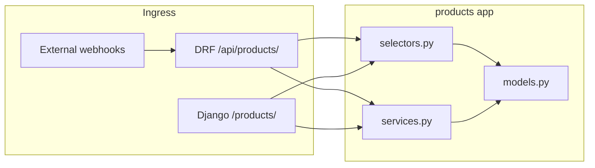

# Single-Tenant Frontend Consolidation — Handoff & Progress

Use this document to resume work in a **new agent session** without re-deriving context. Read [`.cursor/rules/consolidated-frontend.mdc`](../../.cursor/rules/consolidated-frontend.mdc) before changing backend code.

Optional: attach the Cursor plan `frontend_consolidation_roadmap` for full narrative; **this file is the in-repo source of truth** for status and next steps.

---

## Current next action

**Do Phase 2 for `products` only** (do not start `entities` Phase 1 until `products` Phase 2 is done and committed).

1. Add [`backend/products/template_views.py`](../../backend/products/template_views.py) — class-based or function views; `@login_required` where analytics parity is needed.
2. Add templates under [`backend/products/templates/products/`](../../backend/products/templates/products/) (e.g. `dashboard.html`, `product_detail.html`, HTMX partials later).
3. Mount **HTML** routes separately from DRF — e.g. prefix `/products/` in [`backend/products/urls.py`](../../backend/products/urls.py) and include from [`backend/backend/urls.py`](../../backend/backend/urls.py) if not already at project root.
4. Views call **selectors only** (see table below); never `requests.get('/api/products/...')`.
5. Run verification tests (below), update this doc (Phase 2 column + commit SHA), commit.

Phase 3+ (shared base layout, global auth, Next.js removal) stays **out of scope** until Phase 2 works for `products`.

---

## Topological workflow (per app)

Complete **Phase 1 → Phase 2** for one Django app, verify tests, commit, update this doc, then move to the next app. Do **not** delete Next.js routes (Phase 5) or the frontend Docker service (Phase 6) until all targeted apps have HTML views.

```text
products (P1 done → P2 next) → entities → interactions → campaigns / offers → …
```

See also [`docs/APPS.md`](../APPS.md) for app descriptions.

---

## Layer conventions (mandatory)

| Module | Responsibility | Used by |
|--------|----------------|---------|
| [`selectors.py`](../../backend/products/selectors.py) | Read-only: querysets, aggregates, dashboard `dict` payloads | DRF views, `template_views`, future HTMX |
| [`services.py`](../../backend/products/services.py) | Writes: clone, transactions, mutation orchestration | DRF actions, forms/POST handlers |

Rules (from consolidated-frontend rule):

1. **Single-process** — Django only in the runtime image; no Node sidecar for the customer dashboard.
2. **Preserve REST API** — Do not remove or break `/api/...` DRF endpoints (webhooks, tracking scripts).
3. **No loopback** — Template views must not HTTP-call your own API.
4. **Shared layer** — API and HTML must call the same selector/service functions.
5. **Templates** — ``, HTMX/Alpine when needed; no thick SPA bundles in Phase 2.

---

## Global phases

| Phase | Description | Status |
|-------|-------------|--------|
| 0 | This tracking document | done |
| 1 | Service/selector extraction per app | in_progress — **`products` done**; other apps pending |
| 2 | Django template views + `templates/<app>/` per app | pending — **`products` is next** |
| 3 | Shared `templates/base.html`, HTMX/Alpine static assets | pending |
| 4 | Session auth gates on HTML routes (mirror DRF `IsAuthenticated` where needed) | pending |
| 5 | Remove Next.js routes per completed app | pending |
| 6 | Remove frontend service from Docker; update README / FRONTEND docs | pending |

---

## App rollout

| App | Phase 1 | Phase 2 | Phase 1 commits |
|-----|---------|---------|-----------------|
| **products** | done | **next** | `87ac531` (refactor), `fb3ded6` (doc SHA) |
| entities | pending | pending | — |
| interactions | pending | pending | — |
| campaigns | pending | pending | — |
| offers | pending | pending | — |

---

## `products` app reference

### URLs

| Surface | Prefix | Config |
|---------|--------|--------|
| REST API (unchanged) | `/api/products/` | [`backend/backend/urls.py`](../../backend/backend/urls.py) → [`backend/products/urls.py`](../../backend/products/urls.py) (`DefaultRouter` + analytics paths) |
| HTML (Phase 2) | `/products/` (proposed) | Add to `products/urls.py`; separate `urlpatterns` from `router.urls` |

Analytics API names (for `reverse('products:…')` in tests): `analytics-dashboard`, `analytics-divisions`, `analytics-categories`, `analytics-market`, `analytics-pricing`, `analytics-growth`, `analytics-recommendations`.

### Code layout (after Phase 1)

| File | Role |
|------|------|
| [`selectors.py`](../../backend/products/selectors.py) | All read/analytics logic |
| [`services.py`](../../backend/products/services.py) | `duplicate_product` only |
| [`views.py`](../../backend/products/views.py) | DRF viewsets + filters; thin delegation to selectors |
| [`analytics.py`](../../backend/products/analytics.py) | Thin `@api_view` → `Response(selector())` |
| [`test_factories.py`](../../backend/products/test_factories.py) | `create_test_organization()`, `create_test_division()` |

### Selectors to use in Phase 2 templates (examples)

| Page / partial | Selector(s) |
|----------------|-------------|
| Products dashboard | `get_product_analytics_dashboard()`, optional `get_product_recommendations()` |
| Divisions overview | `get_division_analytics_dashboard()`, `divisions_queryset()` |
| Category browser | `get_category_analytics()`, `category_tree_roots()` |
| Product list | `products_active_queryset()` or `products_list_queryset(action='list')` |
| Product detail | `products_list_queryset(action='retrieve')` + model by PK; bundle: `get_bundle_info(product)` |
| Search (server-side) | `products_search_advanced(query=…)` |

Do not re-implement aggregations in templates or views.

### Next.js routes to replace (Phase 5, not now)

| Next.js | Purpose |
|---------|---------|
| [`frontend/src/app/products/page.tsx`](../../frontend/src/app/products/page.tsx) | Product list / dashboard |
| [`frontend/src/app/products/[id]/page.tsx`](../../frontend/src/app/products/[id]/page.tsx) | Product detail |

Keep these files until Phase 2 HTML is verified in the browser.

---

## Verification / test gate

### Primary gate (Phase 1 regression — must stay green)

```bash
# From repo root — build once if needed:
docker build -f backend/Dockerfile -t backboneos-test backend

# Start test DB (from backend/):
docker compose -f docker-compose.test.yml up -d test-db test-redis

# Phase 1 API contract tests (10 tests — proven green after refactor):
docker run --rm --network backboneos-test-network \
  -v "$(pwd)/backend:/app" -w /app \
  -e DJANGO_SETTINGS_MODULE=backend.docker_test_settings \
  -e POSTGRES_HOST=test-db \
  -e POSTGRES_DB=test_mydatabase \
  -e POSTGRES_USER=myuser \
  -e POSTGRES_PASSWORD=mypassword \
  -e POSTGRES_PORT=5432 \
  backboneos-test python manage.py test products.tests.ProductsAPITests --keepdb
```

### Full app suite (aspirational; not green yet)

```bash
# Ideal when local docker-compose backend works:
docker compose exec backend python manage.py test products

# Same as above with test compose + keepdb:
docker run --rm --network backboneos-test-network \
  -v "$(pwd)/backend:/app" -w /app \
  -e DJANGO_SETTINGS_MODULE=backend.docker_test_settings \
  -e POSTGRES_HOST=test-db \
  -e POSTGRES_DB=test_mydatabase \
  -e POSTGRES_USER=myuser \
  -e POSTGRES_PASSWORD=mypassword \
  backboneos-test python manage.py test products --keepdb
```

`manage.py check products` should report no issues.

### Known test debt (fix when touching tests; not blocking Phase 2)

- Many `tests.py` classes still create `Division` without `organization` — use [`test_factories.create_test_division()`](../../backend/products/test_factories.py) (pattern in [`offers/tests.py`](../../backend/offers/tests.py)).
- Model tests expect `Division.categories_count` / `__str__` without organization name — may not match current [`our_institution.models.Division`](../../backend/our_institution/models.py).
- [`tests_analytics.py`](../../backend/products/tests_analytics.py): some assertions expect legacy JSON keys (e.g. `optimization_opportunities`); selectors preserve **current API** shape (`opportunities`, `recommendations`, etc.).

---

## Phase 2 checklist (`products`) — copy into PR / session

- [ ] `template_views.py` created; imports from `.selectors` only for reads
- [ ] `templates/products/dashboard.html` (and detail if needed)
- [ ] HTML `urlpatterns` mounted at `/products/` (no collision with `/api/products/`)
- [ ] Login required on analytics-equivalent pages (minimum: mirror API `IsAuthenticated`)
- [ ] `ProductsAPITests` still pass
- [ ] Manual smoke: load `/products/` in browser with backend running
- [ ] This doc: Phase 2 = `done`, commit SHA recorded

---

## After `products` Phase 2

1. **Phase 1 for `entities`** — same pattern: add `selectors.py`, thin DRF/views, preserve `/api/entities/` (or actual prefix).
2. Repeat Phase 2 for `entities` HTML.
3. Later globally: Phase 3 base template, Phase 4 auth, Phase 5 delete `frontend/src/app/products/*`, Phase 6 Docker/docs.

---

## Architecture (target)


