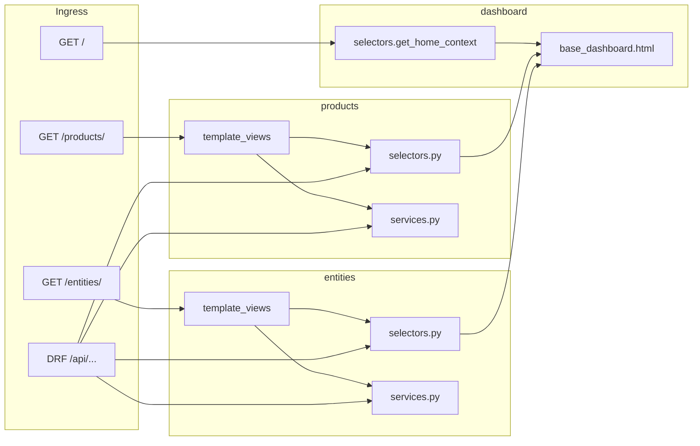

# Single-Tenant Frontend Consolidation — Handoff & Progress

Use this document to resume work in a **new agent session** without re-deriving context. Read [`.cursor/rules/consolidated-frontend.mdc`](../../.cursor/rules/consolidated-frontend.mdc) before changing backend code.

Optional: attach the Cursor plan `frontend_consolidation_roadmap` for full narrative; **this file is the in-repo source of truth** for status and next steps.

---

## Current next action

**Do Phase 1 + Phase 2 for `interactions`** — extract selectors/services, then HTML at `/interactions/` (same pattern as products and entities).

1. Add `interactions/selectors.py` and `interactions/services.py` for shared reads/writes.
2. Add template views, templates, and `template_urls.py` with a dedicated HTML namespace.
3. Mount under [`backend/backend/urls.py`](../../backend/backend/urls.py); enable sidebar link when ready.
4. Run `dashboard.tests` + relevant regression tests; update this doc with commit SHA.

---

## Topological workflow (per app)

```text
dashboard home (done) → products P2 (done) → entities P1+P2 (done) → interactions (next) → …
```

Complete **Phase 1 → Phase 2** per app after the shared layout exists. Do **not** delete Next.js routes (Phase 5) or the frontend Docker service (Phase 6) until HTML is verified.

See also [`docs/APPS.md`](../APPS.md).

---

## Layer conventions (mandatory)

| Module | Responsibility | Used by |
|--------|----------------|---------|
| `selectors.py` | Read-only: querysets, aggregates, dashboard dicts | DRF, `template_views` |
| `services.py` | Writes: mutations, transactions | DRF actions, POST handlers |

Rules: single Django process; preserve `/api/...` DRF; no HTTP loopback from templates; shared selectors; `` for app pages.

---

## Global phases

| Phase | Description | Status |
|-------|-------------|--------|
| 0 | This tracking document | done |
| 1 | Service/selector extraction per app | in_progress — **`products`**, **`entities`** done |
| 2 | Django template views per app | in_progress — **`products`**, **`entities`** done; **`interactions` next** |
| 3 | Shared base layout + Tailwind CSS | **done** — [`base_dashboard.html`](../../backend/templates/base_dashboard.html), compiled [`static/dist/styles.css`](../../backend/static/dist/styles.css) |
| 4 | Session auth on HTML | **partial done** — `/login/`, `@login_required` on `/`, `/products/`, `/entities/` |
| 5 | Remove Next.js routes per app | pending |
| 6 | Docker/docs cleanup | pending |

---

## Dashboard home (milestone complete)

Replaces [`frontend/src/app/page.tsx`](../../frontend/src/app/page.tsx) (mock stats/actions/activity).

| Item | Location |
|------|----------|
| App | [`backend/dashboard/`](../../backend/dashboard/) |
| Selector | [`dashboard/selectors.py`](../../backend/dashboard/selectors.py) → `get_home_context()` (v1 static; v2 real counts later) |
| View | [`dashboard/template_views.py`](../../backend/dashboard/template_views.py) → `home` |
| Templates | [`backend/templates/base_dashboard.html`](../../backend/templates/base_dashboard.html), [`templates/dashboard/home.html`](../../backend/templates/dashboard/home.html), [`templates/includes/`](../../backend/templates/includes/) |
| CSS source | [`backend/static/src/input.css`](../../backend/static/src/input.css) (shadcn tokens + dashboard layout) |
| CSS output | [`backend/static/dist/styles.css`](../../backend/static/dist/styles.css) via Tailwind v3 CLI |
| Tests | [`dashboard/tests.py`](../../backend/dashboard/tests.py) |

### URLs

| Path | Handler |
|------|---------|
| `/` | HTML dashboard (`dashboard:home`) — requires login |
| `/login/` | Session login |
| `/logout/` | Session logout (POST) |
| `/api/` | JSON API catalog (`api-catalog`) — was JSON at `/` before migration |

**Note:** URL name `api-catalog` avoids clash with DRF router `api-root` from [`our_institution`](../../backend/our_institution/urls.py).

### Access

- **Django CRM UI:** http://localhost:8000/ (after `docker-compose up backend`)
- **Products CRM (Django):** http://localhost:8000/products/ — requires login; legacy Next.js catalog still at http://localhost:3000/products until Phase 5
- **Entities CRM (Django):** http://localhost:8000/entities/ — requires login; legacy Next.js at http://localhost:3000/entities until Phase 5
- **Next.js (legacy):** http://localhost:3000/ until Phase 5

### Commit

`4d7334b` — feat(dashboard): migrate homepage to Django templates at /

---

## Products HTML (Phase 2 complete)

Replaces [`frontend/src/app/products/page.tsx`](../../frontend/src/app/products/page.tsx) and [`frontend/src/app/products/[id]/page.tsx`](../../frontend/src/app/products/[id]/page.tsx).

| Item | Location |
|------|----------|
| Reads | [`products/selectors.py`](../../backend/products/selectors.py) — `get_products_list_context`, `get_product_detail_context`, `get_product_form_options` |
| Writes | [`products/services.py`](../../backend/products/services.py) — `create_product`, `update_product`, `delete_product` (shared with DRF) |
| Forms | [`products/forms.py`](../../backend/products/forms.py) |
| Views | [`products/template_views.py`](../../backend/products/template_views.py) |
| URLconf | [`products/template_urls.py`](../../backend/products/template_urls.py) — namespace `products_html` |
| Templates | [`products/templates/products/`](../../backend/products/templates/products/) — `list.html`, `create.html`, `detail.html` |
| Tests | [`products/tests_template_views.py`](../../backend/products/tests_template_views.py) |

### URLs

| Path | Handler |
|------|---------|
| `/products/` | List + filters + pagination (`products_html:list`) |
| `/products/new/` | Create (`products_html:create`) |
| `/products/<uuid>/` | Detail + full edit form (`products_html:detail`) |
| `/products/<uuid>/delete/` | POST delete (`products_html:delete`) |
| `/api/products/` | DRF (unchanged) |

### Access

- http://localhost:8000/products/ (list)
- http://localhost:8000/products/new/ (create)
- Sidebar **Products** → `products_html:list`; dashboard quick action **Add Product** → `/products/new/`

### DRF integration

`ProductViewSet` delegates mutations to [`services.py`](../../backend/products/services.py) via `perform_create`, `perform_update`, and `perform_destroy` (`product_write_payload_from_request` merges serializer data with `*_ids` from the request body). M2M write logic was removed from [`serializers.py`](../../backend/products/serializers.py) to avoid duplication.

### UI notes

- Flash messages: [`base_dashboard.html`](../../backend/templates/base_dashboard.html) (`django.contrib.messages`)
- Products-specific CSS: `/* Products CRM */` block in [`input.css`](../../backend/static/src/input.css) (tables, forms, badges, `<details>` sections)

### Commit

`8091756` — feat(products): implement products management UI and backend integration

---

## Entities HTML (Phase 2 complete)

Replaces [`frontend/src/app/entities/page.tsx`](../../frontend/src/app/entities/page.tsx), [`frontend/src/app/entities/people/[id]/page.tsx`](../../frontend/src/app/entities/people/[id]/page.tsx), and [`frontend/src/app/entities/organizations/[id]/page.tsx`](../../frontend/src/app/entities/organizations/[id]/page.tsx).

| Item | Location |
|------|----------|
| Reads | [`entities/selectors.py`](../../backend/entities/selectors.py) — `get_entities_list_context`, `get_person_detail_context`, `get_organization_detail_context`, `get_entities_form_options` |
| Writes | [`entities/services.py`](../../backend/entities/services.py) — person/org CRUD, `create_individual_profile` (shared with DRF) |
| Forms | [`entities/forms.py`](../../backend/entities/forms.py) |
| Views | [`entities/template_views.py`](../../backend/entities/template_views.py) |
| URLconf | [`entities/template_urls.py`](../../backend/entities/template_urls.py) — namespace `entities_html` |
| Templates | [`entities/templates/entities/`](../../backend/entities/templates/entities/) — `list.html`, `person_create.html`, `person_detail.html`, `organization_create.html`, `organization_detail.html` |
| Tests | [`entities/tests_template_views.py`](../../backend/entities/tests_template_views.py) |

### URLs

| Path | Handler |
|------|---------|
| `/entities/` | Tabbed list (`?tab=people\|organizations`) — `entities_html:list` |
| `/entities/people/new/` | Create person (`entities_html:person_create`) |
| `/entities/people/<uuid>/` | Person detail + edit (`entities_html:person_detail`) |
| `/entities/people/<uuid>/create-profile/` | POST create profile (`entities_html:person_create_profile`) |
| `/entities/people/<uuid>/delete/` | POST delete person (`entities_html:person_delete`) |
| `/entities/organizations/new/` | Create org (`entities_html:org_create`) |
| `/entities/organizations/<uuid>/` | Org detail + edit (`entities_html:org_detail`) |
| `/entities/organizations/<uuid>/delete/` | POST delete org (`entities_html:org_delete`) |
| `/api/entities/` | DRF (unchanged) |

### Access

- http://localhost:8000/entities/ (list)
- http://localhost:8000/entities/people/new/ (create person)
- Sidebar **Entities** → `entities_html:list`; dashboard quick action **Add Entity** → `/entities/people/new/`

### DRF integration

`PersonViewSet` and `OrganizationViewSet` delegate mutations to [`services.py`](../../backend/entities/services.py) via `perform_create`, `perform_update`, and `perform_destroy`. Document uniqueness validation lives in `validate_person_document` / `validate_organization_document` (called from serializers and services). `create_profile` action uses `create_individual_profile`.

### UI notes

- Tabbed people/organizations list (query param `tab`, same UX as Next.js single `/entities` route)
- Read-only contacts, addresses, and profile summary on person detail; **Crear perfil** POST (wired; was dead in Next.js)
- Org detail uses FK `<select>` widgets (improvement over Next.js text inputs)
- Entities-specific CSS: `/* Entities CRM */` block in [`input.css`](../../backend/static/src/input.css)

### Deferred (follow-up, not blocking Phase 5)

- Contact/address CRUD forms on organization detail
- Full `IndividualProfile` M2M editor (industries, skills, functions)
- List `search_semantic` and extra filter dropdowns (API-ready; Next list did not use them)

### Commit

*(fill SHA on commit)* — feat(entities): Django HTML CRM at /entities/ with selectors and services

---

## App rollout

| App | Phase 1 | Phase 2 | Notes |
|-----|---------|---------|-------|
| **dashboard** | n/a | home done | Shared shell for all apps |
| **products** | done | **done** | P1: `87ac531`, `fb3ded6`; P2: `8091756` |
| **entities** | **done** | **done** | selectors + services + HTML; commit SHA TBD |
| interactions | pending | pending | — |
| campaigns | pending | pending | — |
| offers | pending | pending | — |

---

## `products` app reference

### URLs

| Surface | Prefix |
|---------|--------|
| REST API | `/api/products/` |
| HTML | `/products/` (`products_html` namespace) |

### Phase 2 selectors (in use)

| Page | Selector(s) |
|------|-------------|
| Product list | `get_products_list_context()` → `products_list_queryset`, `get_product_analytics_dashboard()['overview']` |
| Product detail | `get_product_detail_context()` → `get_bundle_info` |
| Forms | `get_product_form_options()` |

### Next.js to retire later (Phase 5)

- [`frontend/src/app/page.tsx`](../../frontend/src/app/page.tsx) — superseded by Django `/`
- [`frontend/src/app/products/page.tsx`](../../frontend/src/app/products/page.tsx)
- [`frontend/src/app/products/[id]/page.tsx`](../../frontend/src/app/products/[id]/page.tsx)
- [`frontend/src/app/entities/page.tsx`](../../frontend/src/app/entities/page.tsx)
- [`frontend/src/app/entities/people/[id]/page.tsx`](../../frontend/src/app/entities/people/[id]/page.tsx)
- [`frontend/src/app/entities/organizations/[id]/page.tsx`](../../frontend/src/app/entities/organizations/[id]/page.tsx)

---

## `entities` app reference

### URLs

| Surface | Prefix |
|---------|--------|
| REST API | `/api/entities/` |
| HTML | `/entities/` (`entities_html` namespace) |

### Phase 2 selectors (in use)

| Page | Selector(s) |
|------|-------------|
| Entity list | `get_entities_list_context()` — tabbed people/orgs, search, pagination |
| Person detail | `get_person_detail_context()` — contacts, addresses, profile summary |
| Organization detail | `get_organization_detail_context()` |
| Forms | `get_entities_form_options()` |

---

## Tailwind build (Phase 3)

Toolchain lives under [`backend/`](../../backend/): [`package.json`](../../backend/package.json), [`tailwind.config.js`](../../backend/tailwind.config.js) (theme ported from [`frontend/tailwind.config.js`](../../frontend/tailwind.config.js)).

```bash
cd backend
npm install
npm run tailwind:build    # writes static/dist/styles.css (minified)
npm run tailwind:watch    # local dev rebuild
```

- **Templates** load `` only (no separate `dashboard.css`).
- **`static/dist/styles.css`** is gitignored (`dist/` in root `.gitignore`); run `tailwind:build` locally or rely on Docker/CI (`Dockerfile`, `Dockerfile.prod` builder stage).
- **docker-compose dev** mounts `./backend:/app`, which overwrites image-built `static/dist/` — run `npm run tailwind:build` (or `tailwind:watch`) on the host when styling changes.

Production images run `npm ci`, `tailwind:build`, and `collectstatic` in the `Dockerfile.prod` builder; runtime remains a single Python process (`entrypoint.sh` may re-run `collectstatic` idempotently).

---

## Verification / test gate

```bash
cd backend && npm install && npm run tailwind:build

docker build -f backend/Dockerfile -t backboneos-test backend

# Dashboard + products + entities API + HTML (33 tests):
docker run --rm -v "$(pwd)/backend:/app" -w /app \
  -e DJANGO_SETTINGS_MODULE=backend.test_settings \
  backboneos-test python manage.py test \
    dashboard.tests \
    products.tests.ProductsAPITests products.tests_template_views \
    entities.tests.PersonAPITest entities.tests.OrganizationAPITest \
    entities.tests.PersonViewSetTests entities.tests.OrganizationViewSetTests \
    entities.tests_template_views
```

`manage.py check` should report no issues.

### Known test debt (not blocking)

- Full `products` suite: Division fixtures, analytics JSON drift — see earlier notes.
- HTML tests use `backend.test_settings` (SQLite + simple staticfiles storage).

---

## Phase 2 checklist (`products`)

- [x] `template_views.py` + selectors only (writes via `services.py`)
- [x] `templates/products/*.html` extend `base_dashboard.html`
- [x] `/products/` URL mount (`products.template_urls`, not DRF `urls.py`)
- [x] Sidebar Products link → `products_html:list`
- [x] `ProductsAPITests` + `dashboard.tests` + `tests_template_views` green
- [x] Doc updated — commit `8091756`

---

## Phase 2 checklist (`entities`)

- [x] `selectors.py` + `services.py`; DRF `perform_*` delegation
- [x] `template_views.py` + `forms.py` (writes via `services.py`)
- [x] `templates/entities/*.html` extend `base_dashboard.html`
- [x] `/entities/` URL mount (`entities.template_urls`, namespace `entities_html`)
- [x] Sidebar Entities link → `entities_html:list`
- [x] `dashboard.tests` + entities API subset + `tests_template_views` green (33 tests in gate)
- [x] Doc updated — commit SHA TBD

---

## Manual verification (`entities` Phase 2)

Automated gate covers auth, tabs, search, person/org create/update/delete, profile create, 404. Before Phase 5, manually confirm:

- [ ] Login required on `/entities/`
- [ ] Tab switch people ↔ organizations preserves search
- [ ] Create person → detail with flash; create org → detail
- [ ] Person detail: save FK fields; create profile when missing
- [ ] Delete from list and detail
- [ ] `/api/entities/` unchanged (`PersonAPITest`, `OrganizationAPITest`, viewset tests)

---

## Manual verification (`products` Phase 2)

Automated gate (22 tests) covers auth redirects, list/search/filter, create, update, delete, and 404. Before Phase 5, manually confirm in the browser:

- [ ] Login required on `/products/`
- [ ] List pagination and category filter behave as expected with real data
- [ ] Create at `/products/new/` → detail page with flash message
- [ ] Detail save persists M2M fields (modalities, tags, bundle members)
- [ ] Delete from detail returns to list
- [ ] `/api/products/` unchanged for API clients (`ProductsAPITests`)

---

## Architecture


