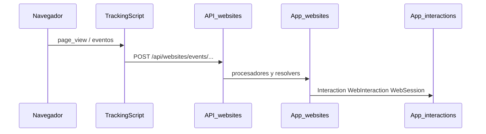

# Tracking web — BackboneOS

Guía canónica para probar y validar eventos de tracking (page view y catálogo de eventos web). Detalle de arquitectura: [docs/backend/websites.md](../backend/websites.md).

## Flujo resumido



## Inicio rápido (5 minutos)

```bash
# Desde la raíz del repositorio
docker compose up -d

cd backend
python test_page_view_tracking.py --wait
# Abrir la URL del sitio de prueba en el navegador, volver a la terminal y pulsar ENTER
```

Resultado esperado: validaciones en verde (Channel owned, Medium `web_interaction`, TouchpointType `web_page`, `WebSession` alineada con `session_id` del script).

## Herramientas

| Herramienta | Uso |
|-------------|-----|
| `test_page_view_tracking.py --wait` | Validación completa antes/después |
| `inspect_page_view_data.py` | Inspección rápida de interacciones recientes |
| `manage.py inspect_tracking` | Inspección integrada en Django |
| `monitor_logs.sh` | Logs en vivo del backend |

```bash
docker compose exec backend python manage.py inspect_tracking
docker compose exec backend python manage.py inspect_tracking --session "sess_abc"
```

## Endpoint principal

- `POST /api/websites/events/page-view/` — evento page view (ver catálogo completo en [websites.md](../backend/websites.md#catalogo-de-eventos)).

## Escenarios de prueba

| Escenario | Interacciones esperadas |
|-----------|-------------------------|
| Tráfico directo | 1 (`page_view`) |
| Landing (`is_landing_page=true`) | 2 (`page_view` + `session_start`) |
| Referrer externo | 2–3 (`referrer_click` + `page_view` + opcional `session_start`) |
| UTM | Channel/Medium según parámetros UTM |

## Resolución de problemas

### No llegan eventos

1. `docker compose ps` — backend en ejecución.
2. Consola del navegador y pestaña Network (llamada a la API).
3. Script de tracking cargado en la página.

### Validación fallida

1. Salida detallada de `test_page_view_tracking.py`.
2. `docker compose logs backend`.
3. `python inspect_page_view_data.py`.

### Session ID y WebSession

**Síntoma:** `WebInteraction.session_id` distinto de `WebSession.session_id`; consultas por sesión incompletas.

**Causa (corregida):** `WebSession._create_new_session()` generaba un ID aleatorio en lugar de reutilizar el `session_id` del script. `infer_session_for_interaction()` buscaba por `visitor_cookie` en lugar del `session_id` del evento.

**Comportamiento correcto:**

1. Tomar `session_id` de `WebInteraction` (script JS).
2. Buscar `WebSession` con ese `session_id`.
3. Actualizar contadores o crear sesión con el mismo ID (fallback UUID solo si falta `session_id`).

**WebSession:** debe crearse/actualizarse en el mismo flujo que procesa el page view, usando el identificador del cliente.

Más contexto: [websites.md — Gestión de sesiones](../backend/websites.md#gestion-de-sesiones).

## Objetos creados por page view

Website → Channel (owned) → Medium → TouchpointType → Touchpoint → Interaction → WebInteraction → WebSession.

## Historial

Los resúmenes de implementación y validación originales se condensaron en esta guía. Para el historial de cambios en el repositorio, usar `git log` en `backend/websites/` y `docs/tracking/`.

Documentos históricos (referencia breve, pueden contener rutas obsoletas):

- [TRACKING_IMPLEMENTATION_SUMMARY.md](TRACKING_IMPLEMENTATION_SUMMARY.md)
- [TRACKING_VALIDATION_COMPLETE.md](TRACKING_VALIDATION_COMPLETE.md)

## Relacionado

- [docs/backend/websites.md](../backend/websites.md)
- [docs/backend/connectors.md](../backend/connectors.md)
- [docs/TESTING.md](../TESTING.md)
- [backend/README.md](../../backend/README.md)
